# Multica Agent 4 分钟耗时分析

## 1. 分析对象

- Issue URL: `http://101.35.232.18:3000/model-config-v2-15/issues/03d3eb6a-60fc-4d81-a677-cd4873bd3ec0`
- Workspace slug: `model-config-v2-15`
- Issue ID: `03d3eb6a-60fc-4d81-a677-cd4873bd3ec0`
- Task ID: `5514852d-7355-4ac1-bc1a-da74976cf8f1`
- Agent: `Lark (GPT-5 mini:M1P)`
- Runtime: `Copilot (MBCM49MQQF9H)`
- Provider: `copilot`
- 记录时间: `2026-04-21 22:33:55 CST`

---

## 2. 一句话结论

这次看到的 “花了 4min” 基本不是：

- 队列排队
- Multica 后端处理
- 数据库写入
- WebSocket 推送

而是 agent 在 runtime 内真实执行了约 `4 分 02 秒`。其中真正的 shell / bash 工具执行时间只有大约 `12 秒`，其余大部分时间花在模型思考、组织下一步动作和生成文本上。

---

## 3. 生命周期拆解

从线上 PostgreSQL 的 `agent_task_queue` 记录看：

| 阶段 | 时间（CST） | 耗时 |
|---|---|---:|
| Issue 创建 / Task 入队 | 22:20:09 | - |
| Task 被 runtime claim | 22:20:13 | 入队后 `3.2s` |
| Task started | 22:20:13 | claim 后 `0.8s` |
| Task completed | 22:24:16 | started 后 `4m 02s` |

可直接得出：

- 排队时间约 `3.2s`
- 分发到启动的系统开销约 `0.8s`
- 真正执行时间约 `4m 02s`

---

## 4. 甘特图

下面这张图按北京时间把这次 run 的关键阶段拆开。黄色阶段主要是模型思考或生成，绿色阶段是实际工具执行，蓝色是系统状态切换。

```mermaid
gantt
    title Multica Agent 4 分钟耗时甘特图（2026-04-21 CST）
    dateFormat  HH:mm:ss
    axisFormat  %H:%M:%S

    section 系统阶段
    Issue 创建 / Task 入队           :milestone, m1, 22:20:09, 0s
    排队等待 runtime claim           :queue, 22:20:09, 4s
    runtime claim -> task started    :dispatch, 22:20:13, 1s
    Task completed                   :milestone, m2, 22:24:16, 0s

    section 模型思考 / 生成
    理解 issue 并准备首轮动作        :think1, 22:20:13, 22s
    读取 issue 后生成下一步说明       :think2, 22:20:57, 17s
    设为 in_progress 前的规划         :think3, 22:21:14, 22s
    加载 lark skill 后长思考          :think4, 22:21:37, 60s
    发飞书消息前再次规划              :think5, 22:22:38, 36s
    飞书发送完成后整理回写动作        :think6, 22:23:23, 8s
    回写 Multica 前最后一段思考       :think7, 22:23:31, 22s
    收尾文本输出                      :wrapup, 22:23:53, 4s

    section 工具执行
    bash: 读取 issue JSON            :bash1, 22:20:56, 1s
    bash: 更新 issue 为 in_progress  :bash2, 22:21:36, 1s
    skill: 加载 lark                 :skill1, 22:21:36, 1s
    bash: 发送飞书消息               :bash3, 22:23:14, 10s
    bash: 评论并改为 in_review       :bash4, 22:23:52, 1s
```

---

## 5. 关键时间点

按 `task_message` 的时间序列看，主要节点如下：

| 时间（CST） | 事件 | 说明 |
|---|---|---|
| 22:20:34 | 首条文本输出 | 开始说明“先读取 issue JSON” |
| 22:20:56 | `report_intent` + `bash` | 开始读 issue |
| 22:20:57 | `bash` 返回 | 读取 issue 很快 |
| 22:21:14 | 文本输出 | 准备改状态并加载 skill |
| 22:21:36 | `report_intent` + `bash` + `skill` | 改为 `in_progress`，加载 `lark` |
| 22:21:37 | `bash` 返回 | 状态更新完成 |
| 22:22:37 | 文本输出 | 进入“发飞书消息”动作说明 |
| 22:23:14 | `report_intent` + `bash` | 真正开始发飞书 |
| 22:23:23 | `bash` 返回 | 飞书消息发送完成，耗时约 `9.5s` |
| 22:23:31 | 文本输出 | 准备回写 Multica |
| 22:23:52 | `bash` | 评论 issue 并改为 `in_review` |
| 22:23:53 | `bash` 返回 | 回写完成 |
| 22:24:16 | task complete | 整个任务结束 |

---

## 6. 最大耗时段

按消息间隔看，最大的几个空档是：

| 排名 | 时间段 | 时长 | 含义 |
|---|---|---:|---|
| 1 | 22:21:37 -> 22:22:37 | `60.0s` | 加载 `lark` skill 后，模型在组织“如何发飞书消息” |
| 2 | 22:22:38 -> 22:23:14 | `36.0s` | 发飞书前再次思考和生成 |
| 3 | 22:20:34 -> 22:20:56 | `22.0s` | 首轮理解 issue |
| 4 | 22:21:14 -> 22:21:36 | `22.0s` | 准备改状态和加载 skill |
| 5 | 22:23:31 -> 22:23:52 | `21.5s` | 准备评论和回写 issue |
| 6 | 22:20:57 -> 22:21:14 | `17.5s` | 读取 issue 后整理下一步 |
| 7 | 22:23:14 -> 22:23:23 | `9.5s` | 真正发飞书消息的 bash 执行 |

这里有一个很明显的模式：

- 真正的工具调用普遍很快
- 模型在每个动作前后都花了较长时间组织文本和决策
- 特别是加载 `lark` skill 后，出现了最长的 `60s` 空档

---

## 7. 工具与消息统计

这次任务的 `task_message` 统计：

| 类型 | 数量 |
|---|---:|
| `text` | 8 |
| `tool_use: report_intent` | 4 |
| `tool_result: report_intent` | 4 |
| `tool_use: bash` | 4 |
| `tool_result: bash` | 4 |
| `tool_use: skill` | 1 |
| `tool_result: skill` | 1 |

可以看到这是一个“动作不多，但每步都要想很久”的任务，而不是“工具很多、链路很长”的任务。

---

## 8. 模型与 usage 侧信息

`task_usage` 记录显示，这次 run 主要消耗在：

- `gpt-5-mini`
- 少量 `gpt-4o-mini`

线上 usage 记录：

| provider | model | output tokens |
|---|---|---:|
| copilot | `gpt-5-mini` | 6100 |
| copilot | `gpt-4o-mini` | 569 |

这也和上面的现象一致：

- 不是 bash 在忙
- 而是模型生成内容较多，并且分成多轮输出

---

## 9. 不慢在哪里

根据 backend 日志，这次 run 明确不慢在以下位置：

1. `task enqueued -> task claimed` 只有几秒，不是队列积压。
2. `/api/daemon/tasks/:id/start`、`/messages`、`/complete` 都是毫秒级，不是后端接口慢。
3. issue 评论、状态更新也都是毫秒级，不是数据库慢。
4. 最耗时的 bash 也只有约 `9.5s`，不是外部命令整体卡住。

---

## 10. 真正慢在哪里

真正的耗时主要集中在 runtime 内的 agent 决策与生成阶段，表现为：

1. 首轮理解 issue 需要约 `22s`
2. 改状态和加载 skill 前后又分别用了 `17.5s` 和 `22s`
3. 加载 `lark` skill 后出现 `60s` 长空档
4. 发飞书前又用了 `36s`
5. 回写 Multica 前又用了 `21.5s`

换句话说，这次 4 分钟不是“执行链路太长”，而是“动作很少，但模型每一步都在慢慢想”。

---

## 11. 归因判断

按优先级排序，这次耗时最可能的原因是：

1. `Copilot CLI + gpt-5-mini` 在这个任务上思考/生成偏慢。
2. Agent workflow 本身要求多次 `report_intent`，增加了额外回合。
3. `lark` skill 注入后，上下文变大，模型在调用前的规划时间明显变长。
4. 任务虽然简单，但流程要求“先说明、再执行、再回写”，放大了模型时延。

---

## 12. 最终判断

对于这个 issue，可以把 4 分钟拆成一句更准确的话：

> 这不是 Multica 系统层的 4 分钟，而是 Copilot runtime 中的 agent 在执行一个“少量工具调用 + 多轮长思考”的 4 分钟任务。

如果只看系统层：

- 排队很短
- 分发很快
- 后端很快
- DB 很快

如果看 agent 行为层：

- 模型思考时间长
- skill 装载后规划开销大
- 工具动作本身反而不重

---

## 13. 可操作的优化方向

如果目标是把这类任务从 4 分钟压到 1 分钟级，优先级建议如下：

1. 减少 `report_intent` 次数，避免每一步都额外生成说明。
2. 对简单任务走更短 prompt，减少“解释型”输出。
3. 对简单通知类任务绕开大 skill 上下文，使用更窄的执行模板。
4. 评估 `copilot / gpt-5-mini` 在该类操作任务上的时延，必要时切更快模型。
5. 把“读 issue -> 改状态 -> 发消息 -> 回写”收敛成更少轮次，而不是每步都先解释。

---

## 14. 对照实验：另一个 Agent 仅用 1 分 12 秒

针对同一个 issue，后续又跑了一次新的任务：

- Task ID: `8839fd76-6128-42c9-8cee-83f630a680fb`
- Agent: `Lark (GPT-4:M1P)`
- Runtime: `Codex (MBCM49MQQF9H)`
- Provider: `codex`
- 执行时长: `1m11.6s`

这为前面的判断提供了非常好的对照组。

### 14.1 两次 run 并排对比

| 维度 | 第一次慢任务 | 第二次快任务 |
|---|---|---|
| Task ID | `5514852d-7355-4ac1-bc1a-da74976cf8f1` | `8839fd76-6128-42c9-8cee-83f630a680fb` |
| Agent | `Lark (GPT-5 mini:M1P)` | `Lark (GPT-4:M1P)` |
| Runtime | `Copilot (MBCM49MQQF9H)` | `Codex (MBCM49MQQF9H)` |
| Provider | `copilot` | `codex` |
| 纯执行时长 | `4m02s` | `1m11.6s` |
| 最大单段空档 | `60.0s` | `14.0s` |
| 文本消息数 | `8` | `6` |
| `report_intent` 相关事件 | `8` | `0` |
| `skill` 相关事件 | `2` | `0` |
| 执行动作模式 | `report_intent + bash + skill` | `exec_command` 为主 |

这张表说明：

- 同样的业务目标
- 同样的 issue
- 后一次可以在 `1m12s` 内完成

所以 `4m02s` 并不是这个任务的天然耗时下限。

### 14.2 第二次 run 的节奏

第二次任务的消息流更像“直接执行器”：

1. 一开始就进入 `exec_command`
2. 没有单独的 `report_intent`
3. 没有单独的 `skill` 装载轮次
4. 用更少的文本说明状态
5. 最大思考空档只有 `14s`

主要空档如下：

| 时间段 | 时长 | 含义 |
|---|---:|---|
| 22:41:08 -> 22:41:22 | `14.0s` | 首轮准备和读取上下文 |
| 22:41:35 -> 22:41:44 | `9.0s` | 获取 `chatId` 后准备发消息 |
| 22:41:49 -> 22:41:57 | `8.0s` | 发消息后准备回写评论 |

和第一次相比，这次没有出现：

- `60s` 级别的长思考
- `36s` 级别的再次规划
- 每个动作前先做一轮 intent 汇报

### 14.3 第二次 run 的 usage

第二次 run 的 `task_usage` 记录为：

| provider | model | input tokens | cache read tokens | output tokens |
|---|---|---:|---:|---:|
| codex | `gpt-5.4` | 241090 | 224896 | 2921 |

这里可以看出一个很有意思的点：

- 第二次并不是“上下文更少”
- 相反，它读入了大量上下文，并且命中了大量 cache
- 但它的执行风格依然更短、更直接

这说明瓶颈并不只是“上下文大”，更关键的是 agent 如何编排动作。

### 14.4 对照实验带来的新结论

这次对照后，前面的优化判断可以收敛得更明确：

1. 第一优先级不是优化后端，而是优化 agent workflow。
2. `report_intent` 和“先解释再执行”的风格，确实会显著拉长总耗时。
3. 对简单动作型任务，`Codex` 风格的“少解释、直接执行”明显更高效。
4. `skill` 的使用方式比“是否使用 skill”本身更重要。
5. 模型名称会有影响，但这两次最主要的差异更像是 runtime orchestration，而不只是 model label。

### 14.5 更新后的优化优先级

基于两次 run 的对照，优化优先级建议更新为：

1. 优先把简单任务改成“直接执行 + 最后汇报”的编排方式。
2. 对简单任务移除或大幅减少 `report_intent`。
3. 避免把 skill 装载单独拆成一轮，再让模型重新长时间规划。
4. 对简单通知型任务优先走 `exec_command` 风格的短路径。
5. 再考虑 provider / model 切换。

### 14.6 更新后的判断

对这个 case 来说，更准确的结论应当是：

> 4 分钟不是任务本身复杂，而是第一种 agent/runtime 组合采用了更重的解释型 workflow；切到第二种更直接的执行型编排后，同一任务可以稳定压到约 1 分 12 秒。
