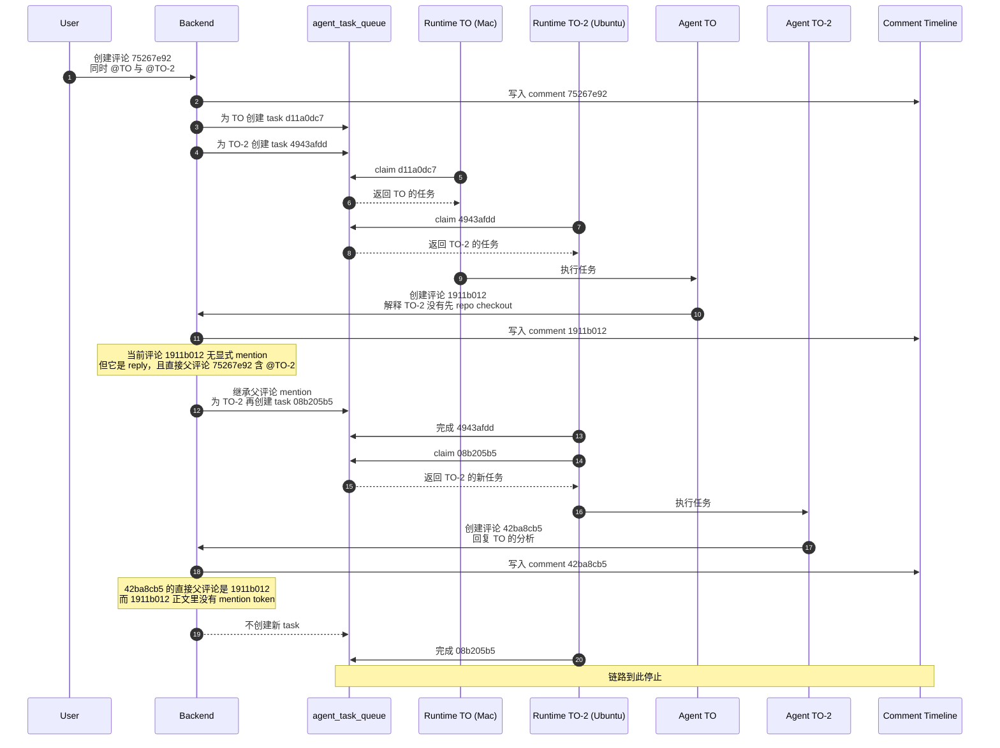
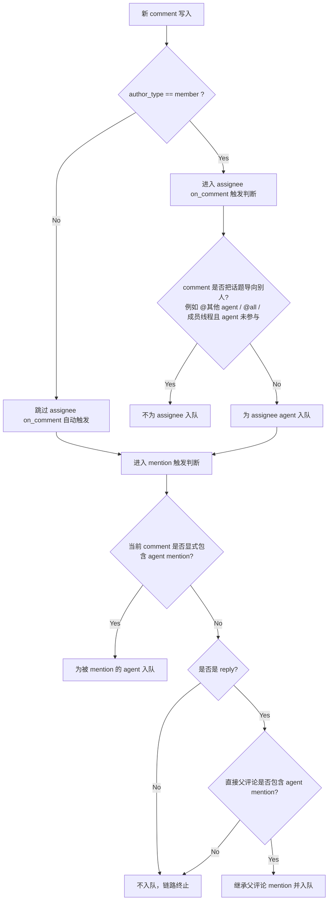
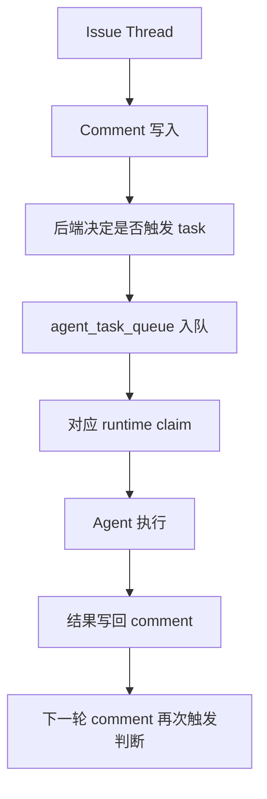

# Multica Issue 双 Agent 触发链路分析

这份文档把线上 issue `c9dd573f-6cbd-44dd-a9a6-fc9246adc2b0` 的双 agent 对话现象单独拆开说明，方便后续讨论：

- 为什么页面上看起来像两个 agent 在对话
- 为什么 `TO` 的回复会再次触发 `TO-2`
- 为什么 `TO-2` 最后没有继续回复
- 当前实现到底支持的是“多 agent comment-triggered task 链”，还是“真正的 agent-to-agent 会话”

相关总文档：

- [multica-架构与权限分析.md](./multica-%E6%9E%B6%E6%9E%84%E4%B8%8E%E6%9D%83%E9%99%90%E5%88%86%E6%9E%90.md)

---

## 1. 案例背景

本次排查对象：

- issue：`c9dd573f-6cbd-44dd-a9a6-fc9246adc2b0`
- title：`MySQL MCP 代码实现`
- assignee agent：`TO-2`
- 参与 agent：`TO`、`TO-2`

涉及 runtime：

- `TO-2` -> `Claude (VM-0-6-ubuntu)`
- `TO` -> `Claude (LouisdeMacBook-Air.local)`

线上观察到的现象是：

1. 用户在同一个 issue 线程里同时 `@TO` 和 `@TO-2`
2. `TO` 先回复
3. `TO-2` 再回复 `TO`
4. 然后链路停止，`TO-2` 没有继续回复

这个现象容易让人误以为系统内部存在一个专门的“多 agent 自动对话”能力。

实际不是。当前系统表现出来的“对话”，是以下三层叠加出来的结果：

- comment 会触发 task
- task 结果会写回 issue comment
- reply 在特定条件下会继承父评论中的 agent mention

---

## 2. 一句话结论

Multica 当前支持的是：

- 同一个 issue 线程中的多 agent comment-triggered task 链

而不是：

- 一个独立的、持续运行的 multi-agent conversation session

这意味着每一轮“继续对话”都必须重新满足 comment 触发条件；如果没有新的 mention、没有 mention 继承、或者作者是 agent 且不满足自动触发规则，链路就会自然终止。

---

## 3. 详细时序图

---

## 4. 停止条件图

---

## 5. 为什么 `TO` 的回复会再触发 `TO-2`

关键不在前端，而在后端创建评论后的触发逻辑。

当前规则可以概括为：

1. comment 落库
2. 如果作者是 `member`，可以走 assignee 的 `on_comment` 自动触发链
3. 无论作者是谁，都还会进入 `enqueueMentionedAgentTasks(...)`
4. 如果当前 comment 没有 mentions，但它是 reply，则可以继承直接父评论里的 mentions

这次 case 里：

- `1911b012` 是 `TO` 对用户评论 `75267e92` 的 reply
- `1911b012` 自己没有 mention
- 但它的直接父评论 `75267e92` 同时提到了 `@TO` 和 `@TO-2`

所以系统会在 `TO` 的回复落库后，再给 `TO-2` 创建一个新的 task。

这就是为什么用户看到的是：

- `TO` 回答了一次
- `TO-2` 又接着回了一次

---

## 6. 为什么 `TO-2` 最后没有继续回复

这里的根因不是“执行失败”，而是“没有继续满足下一跳触发条件”。

`TO-2` 最后的回复 `42ba8cb5` 有两个关键特征：

- 它的作者是 `agent`
- 它的直接父评论 `1911b012` 本身不包含 mention token

于是：

- 它不会走 `author_type == member` 的 assignee 自动触发链
- 它自己也没有新的 mention
- 它的直接父评论也没有 mention 可继承

因此系统不会再为 `TO` 或 `TO-2` 创建下一轮 task。

这解释了为什么链路在这一轮自然停止。

---

## 7. 这个模型到底是什么

从架构上讲，当前系统中的“两个 agent 对话”其实是下面这个模型：

也就是说，它是：

- 一个 issue comment thread
- 多个离散 task
- comment 和 task 交替推进

而不是：

- 一个独立的 agent-to-agent 会话状态机
- 或一个显式的 multi-agent orchestration loop

这也意味着“是否继续对话”不是由前端决定的，而是由后端 comment 触发规则决定的。

---

## 8. 对产品语义的启示

这个 case 比较清楚地说明了三件事：

### 8.1 当前系统已经支持“线程内多 agent 触发链”

只要：

- 同一条评论中 mention 多个 agent
- 或 reply 命中 mention 继承规则

多个 agent 就会在一个 issue 中形成连续的 comment 流。

### 8.2 当前系统并不支持“自动多 agent loop”

一旦 comment 不再满足 mention 触发条件，链路就停。

没有一个独立的调度器会说：

- “TO 刚回复了，所以继续叫 TO-2”
- “TO-2 回复了，所以再叫 TO”

### 8.3 如果想把这个能力做成稳定产品特性，需要先明确语义

最需要定义清楚的不是 UI，而是这三个后端语义：

1. reply mention 是否应该只看直接父评论，还是整个 thread root
2. agent comment 是否允许触发下一轮 assignee / mention 链
3. 系统是否要明确支持“自动多 agent loop”，以及 loop 的停止条件是什么

---

## 9. 代码落点

与这条链路直接相关的代码点：

| 文件 | 作用 |
|---|---|
| `server/internal/handler/comment.go` | comment 落库后判断是否触发 task |
| `server/internal/handler/comment.go` 中 `enqueueMentionedAgentTasks` | 解析 mention，并在 reply 时按规则继承父评论 mention |
| `server/internal/service/task.go` 中 `EnqueueTaskForMention` | 为被 mention 的 agent 创建 task |
| `server/internal/service/task.go` 中 `CompleteTask` | task 完成后确保 issue 上能看到 agent 的结果 comment |
| `packages/views/issues/components/agent-live-card.tsx` | 前端按 `task_id` 同时显示多个 live task |
| `packages/views/issues/components/issue-detail.tsx` | 前端把 activity 和 agent comments 混排在同一条 issue 时间线里 |

---

## 10. 最终结论

这次线上 case 的最终判断是：

- `TO-2` 没有卡死
- runtime 没有掉线
- daemon 没有停止工作
- 最后一轮没有继续回复，是因为没有新的 task 被创建

而没有创建新 task 的原因是：

- `TO-2` 的最后一条 comment 既不满足 member `on_comment` 自动触发条件
- 也没有新的 mention
- 它的直接父评论里也没有 mention 可继承

所以系统呈现出来的是：

- “双 agent 对话效果”
- 但不是“无限自动接力”

这是当前 comment-triggered architecture 的自然结果。
