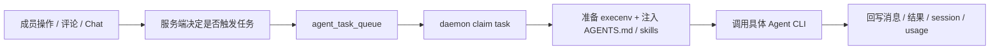
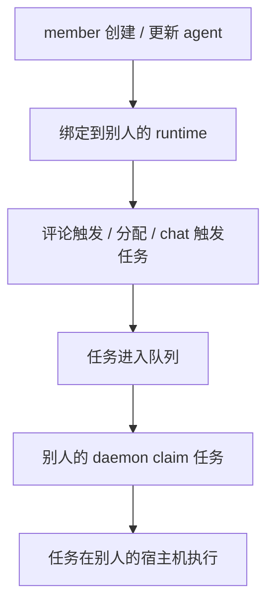

# Multica 架构与权限分析评审摘要

## 1. 这份摘要看什么

这是一份面向产品、平台、安全评审的短版摘要，目标不是覆盖所有实现细节，而是回答四个关键问题：

1. Multica 的核心执行链路是什么
2. Agent 实际是怎么落到本地宿主机执行的
3. Repository、Session、Runtime 分别由谁控制
4. 当前最需要收口的权限风险是什么

完整版分析见：

- [multica-架构与权限分析.md](/Users/louis.ning/project/github/multica/my-docs/multica-架构与权限分析.md)

---

## 2. 一句话结论

Multica 已经具备完整的 AI 协作平台骨架，但当前最敏感的边界不是“Agent 能不能工作”，而是：

- workspace 权限
- runtime 宿主机归属
- session / repo / workdir 的物理落点

这三者还没有完全收口到同一套权限语义上。

---

## 3. 系统主链路

可以把系统简化理解成下面这条链路：

关键点是：

- 服务端负责“是否允许触发”和“任务如何入队”
- daemon 负责“任务在哪台机器执行”
- Agent CLI 只是执行器，不是权限中心

---

## 4. Agent 真正在哪执行

Agent 并不是在服务端统一执行，而是在绑定的 runtime 对应宿主机上执行。

也就是说：

- `agent` 决定逻辑身份
- `runtime` 决定物理执行位置
- `daemon` 决定具体如何在本地启动 CLI、准备 workdir、写回结果

这意味着一个非常现实的问题：

- UI 上看到的是“某个 agent 在工作”
- 实际上任务是在某台具体电脑或宿主环境里执行

因此 runtime 的归属，天然就是权限边界的一部分。

---

## 5. Repositories 怎么处理

Repositories 不是任务启动时自动挂载的代码目录，而是三段式模型：

1. workspace 配置 repo 元数据清单
2. daemon 在宿主机维护 bare clone cache
3. agent 需要代码时显式执行 `multica repo checkout <url>`

这里最容易误解的点有两个：

- `description` 只是说明文字，不参与权限判断
- 真正参与校验的是 `repo URL`

所以系统语义是：

- workspace 声明哪些 repo 合法
- daemon 负责把这些 repo 准备成本地可 checkout 的缓存
- agent 在任务里按需 checkout 成 worktree

---

## 6. Session 会复用吗

会。

Multica 不会默认每次都开一个全新 session，而是尽量复用：

- Issue 模式：按 `(agent_id, issue_id)` 复用
- Chat 模式：按 `chat_session_id` 复用

这会带来两个后果：

1. 好处  
   agent 可以延续上下文，不需要每轮都从零开始

2. 风险  
   一旦 runtime 绑定不严，任务不只是“借用一次别人的机器”，而是可能持续复用那台机器上的：
   - session
   - workdir
   - repo worktree
   - CLI 配置
   - 认证目录

---

## 7. 当前最关键的权限风险

当前代码中，普通 member 创建或更新 agent 时，后端会校验：

- `runtime_id` 属于当前 workspace

但不会进一步校验：

- `runtime.owner_id == current_user_id`

这意味着：

- member 可以把自己的 agent 绑定到同 workspace 下别人的 runtime

然后形成下面这条链路：

这里的问题不等于“直接远程登录别人电脑”，但已经足够形成宿主机级风险：

- 借用别人机器执行任务
- 借用别人机器上的 repo、会话、工具链和本地凭据
- 消耗别人机器上的 CPU、网络、磁盘和模型配额

---

## 8. 建议优先收口的地方

最小、最有效的治理动作是统一 runtime 的权限语义：

| 操作 | owner/admin | member |
|---|---|---|
| 绑定自己的 runtime | Y | Y |
| 绑定别人的 runtime | Y | N |
| 删除自己的 runtime | Y | Y |
| 删除别人的 runtime | Y | N |

后端实现上，通常只需要在：

- `CreateAgent`
- `UpdateAgent`

现有 workspace 校验之后，再补一层：

- 如果当前用户不是 owner/admin
- 则要求 `runtime.owner_id == current_user_id`

否则返回 `403 Forbidden`

---

## 9. 给评审会的建议说法

如果要在评审会上用一句话概括当前状态，建议这样表述：

> Multica 的任务编排和 Agent 执行链路已经清晰，但 runtime 归属、session 复用、repo checkout 最终都落在具体宿主机上，因此 runtime 绑定权限必须与 runtime owner 语义保持一致，否则会形成“workspace 级授权映射到他人宿主机执行”的风险。

---

## 10. 建议阅读顺序

如果评审时间很短，建议按这个顺序看完整版：

1. [7. Agent / Runtime / Daemon 执行架构](/Users/louis.ning/project/github/multica/my-docs/multica-架构与权限分析.md)
2. [9. 会话复用与本地可见性](/Users/louis.ning/project/github/multica/my-docs/multica-架构与权限分析.md)
3. [10. Repositories 处理机制](/Users/louis.ning/project/github/multica/my-docs/multica-架构与权限分析.md)
4. [11. 运行时归属与执行风险](/Users/louis.ning/project/github/multica/my-docs/multica-架构与权限分析.md)
5. [13. 结论](/Users/louis.ning/project/github/multica/my-docs/multica-架构与权限分析.md)
