# Multica 项目架构与权限深度分析

## 1. 项目定位与目标

Multica 是一个 AI 原生任务协作平台，核心理念是让 AI Agent 成为团队中的一等执行者，而不是外部插件。系统目标包括：

- 支持多人、多工作空间（workspace）协作
- 支持 Agent 被分配 Issue、执行任务、回传结果
- 提供 Web 与 Desktop 双端一致的业务体验
- 通过实时事件（WebSocket）保持多端状态同步

---

## 2. 总体架构

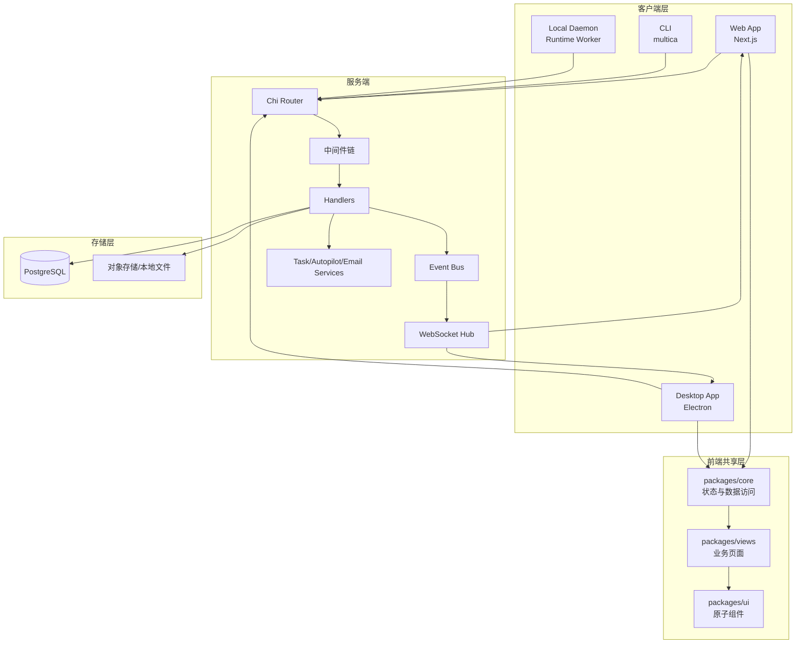

---

## 3. Monorepo 分层设计

### 3.1 目录职责

| 路径 | 职责 | 关键约束 |
|---|---|---|
| server/ | Go 后端 API、WebSocket、Daemon 协议、数据库访问 | 业务权限和多租户校验在这里闭环 |
| apps/web/ | Next.js Web 应用 | App Router，平台特有逻辑仅在 web 侧 |
| apps/desktop/ | Electron 桌面应用 | Tab 系统、Window Overlay、桌面平台桥接 |
| packages/core/ | 共享业务逻辑与状态层 | 不依赖 react-dom，不直接使用 localStorage |
| packages/views/ | 共享业务页面与复合组件 | 不依赖 next/* 与 react-router-dom |
| packages/ui/ | 原子 UI 组件与样式 token | 不引入业务逻辑 |

### 3.2 前端状态架构

- React Query：管理服务器状态（issues、members、agents、inbox、projects 等）
- Zustand：管理客户端状态（UI 过滤、当前选中、Tab/Overlay 状态、草稿）
- WebSocket 事件：触发 Query Invalidation，而不是直接写入业务 store

---

## 4. 后端架构详解

### 4.1 分层结构

| 层级 | 核心目录 | 说明 |
|---|---|---|
| 入口层 | server/cmd/server | HTTP 启动、路由装配、监听器注册 |
| 接口层 | server/internal/handler | 各业务模块 HTTP Handler |
| 中间件层 | server/internal/middleware | Auth、Workspace、DaemonAuth、CSP、日志 |
| 领域服务层 | server/internal/service | 任务调度、自动化触发、邮件等 |
| 事件层 | server/internal/events | 同步事件总线 |
| 实时层 | server/internal/realtime | WebSocket Hub 广播 |
| 数据访问层 | server/pkg/db/generated | sqlc 生成强类型查询 |
| 数据定义层 | server/migrations | 表结构演进 |

### 4.2 中间件职责

| 中间件 | 作用 |
|---|---|
| RequestID | 生成请求追踪 ID |
| RequestLogger | 记录 method/path/status/duration |
| Recoverer | panic 恢复 |
| ContentSecurityPolicy | 安全响应头 |
| CORS | 跨域控制 |
| Auth | 校验 JWT/PAT/Cookie 并注入用户上下文 |
| RequireWorkspaceMember / Role | 校验 workspace 成员与角色权限 |
| DaemonAuth | 校验 mdt_* daemon token |

---

## 5. 核心功能矩阵

| 功能域 | 核心能力 | 后端模块 | 前端模块 |
|---|---|---|---|
| 认证 | Magic Code、Google OAuth、CLI Token | auth handler + auth middleware | auth 页面 + auth store |
| Workspace | 创建、查询、更新、删除、离开 | workspace handler | workspace 页面/切换逻辑 |
| 邀请 | 发起邀请、接受、拒绝、撤销 | invitation handler | invite 页面/弹层 |
| Issues | CRUD、批量更新、子任务、依赖、搜索 | issue handler | issues page/list/board/detail |
| Comments | 评论、编辑、删除、反应、提及 | comment/reaction handler | issue detail comments |
| Projects | 项目 CRUD、搜索 | project handler | project pages |
| Agents | Agent CRUD、归档恢复、技能绑定 | agent handler | agents 管理页面 |
| Skills | Skill CRUD、文件管理、导入 | skill handler | skills 管理页面 |
| Runtime/Daemon | runtime 状态、任务领取与回报 | daemon/runtime/task handler | runtimes 页面 |
| Autopilot | 规则定义、触发、执行记录 | autopilot handler/service | autopilot 页面 |
| Inbox | 通知列表、已读、归档 | inbox handler | inbox 页面 |
| Chat | 会话、消息、待处理任务 | chat handler | chat 组件 |
| 附件 | 上传、读取、删除 | file/attachment handler | issue attachment UI |

---

## 6. 权限模型设计

### 6.1 角色定义

- owner：工作空间所有者，拥有最高权限
- admin：管理者，拥有大部分管理权限，但受 owner 边界限制
- member：普通成员，可参与业务操作但无成员管理权限
- agent：执行身份，通过 agent/daemon 流程触发任务，不是人类管理角色

### 6.2 权限表（工作空间内）

| 操作 | owner | admin | member | agent/daemon |
|---|:---:|:---:|:---:|:---:|
| 查看 workspace | Y | Y | Y | Y(受限) |
| 更新 workspace | Y | Y | N | N |
| 删除 workspace | Y | N | N | N |
| 邀请成员 | Y | Y | N | N |
| 撤销邀请 | Y | Y | N | N |
| 修改成员角色 | Y | N | N | N |
| 移除成员 | Y | N | N | N |
| Issue 创建/更新 | Y | Y | Y | Y(通过任务通道) |
| Issue 删除 | Y | Y | 部分(通常限作者/规则) | N |
| 评论创建 | Y | Y | Y | Y |
| 评论修改/删除 | Y | Y | 作者范围 | 作者范围 |
| Agent 管理 | Y | Y | 部分(创建等) | N |
| Skill 管理 | Y | Y | Y | N |
| Runtime 管理 | Y | Y | Y | daemon 自身上报 |

### 6.3 资源隔离机制

- 每个 workspace 独立业务域
- 请求通过 X-Workspace-Slug 或 X-Workspace-ID 解析目标 workspace
- 中间件先校验成员身份与角色
- SQL 查询按 workspace_id 过滤
- 双层隔离避免跨租户数据串读

---

## 7. 数据模型（核心实体）

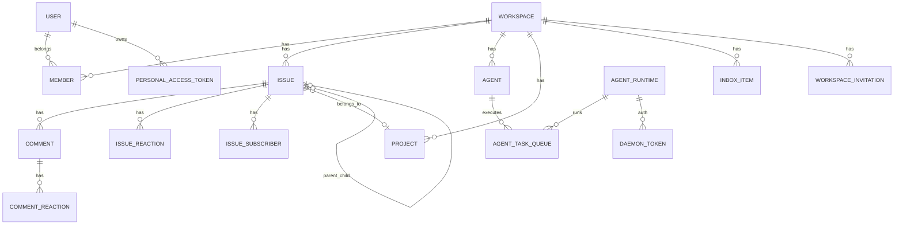

核心表包括：`user`, `workspace`, `member`, `issue`, `comment`, `project`, `agent`, `agent_runtime`, `agent_task_queue`, `inbox_item`, `workspace_invitation`, `personal_access_token`, `daemon_token`。

---

## 8. 关键业务时序图

### 8.1 登录（Magic Code）

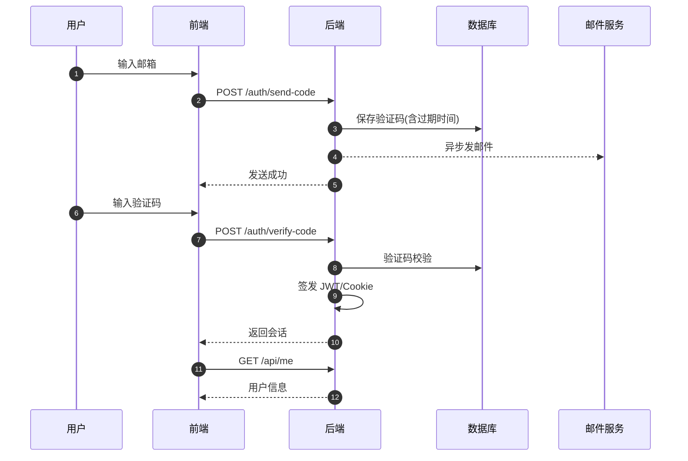

### 8.2 创建 Workspace

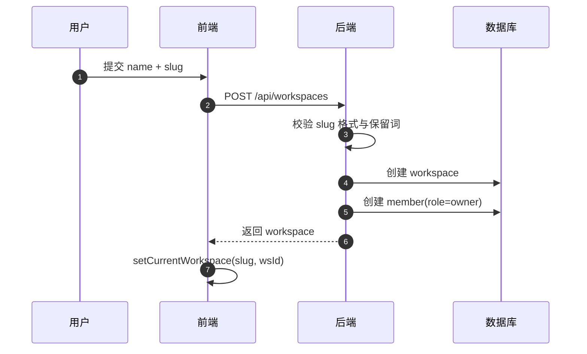

### 8.3 Issue 创建与实时同步

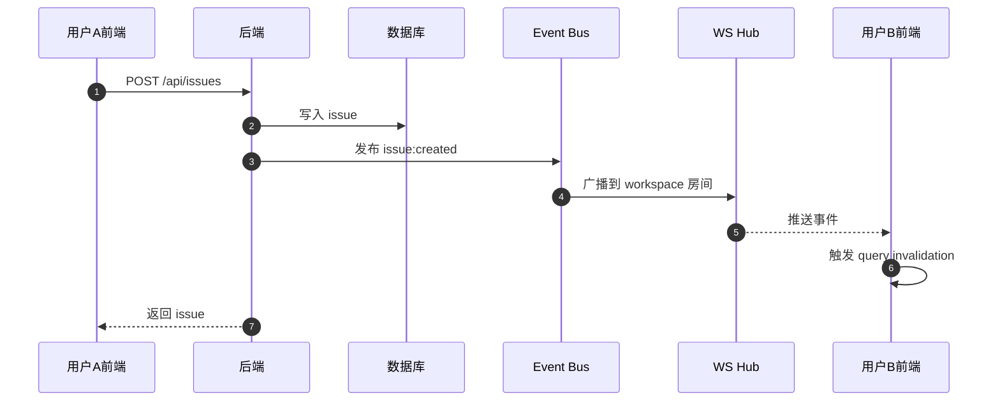

### 8.4 Agent 任务执行（Daemon）

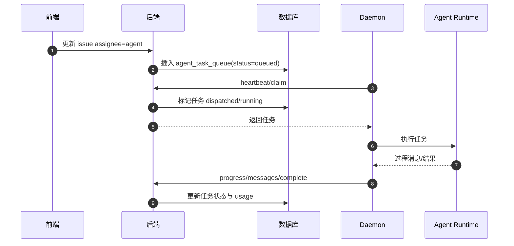

### 8.5 邀请成员流程

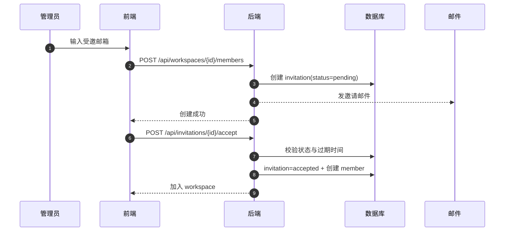

### 8.6 Desktop 跨 Workspace 切换

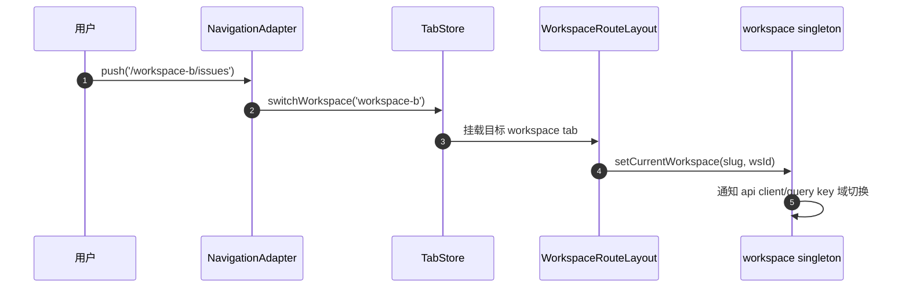

---

## 9. 实时事件模型

| 类别 | 事件示例 | 用途 |
|---|---|---|
| Issue | issue:created/updated/deleted | 列表、详情、看板同步 |
| Comment | comment:created/updated/deleted | 评论流同步 |
| Reaction | reaction:added/removed | 评论和问题反应同步 |
| Agent | agent:created/status/archived | Agent 列表与状态同步 |
| Task | task:dispatch/progress/completed/failed | 执行过程可视化 |
| Inbox | inbox:new/read/archived | 通知中心与红点 |
| Workspace/Member | workspace:updated/member:added/removed | 权限和成员视图同步 |
| Invitation | invitation:created/accepted/declined | 邀请生命周期同步 |
| Autopilot | autopilot:* | 自动化规则状态与运行反馈 |
| Chat | chat:message/done | 聊天流式更新 |

---

## 10. 安全与治理

### 10.1 安全策略

| 维度 | 策略 |
|---|---|
| 身份认证 | JWT + Cookie + PAT + Daemon Token |
| Token 存储 | PAT/Daemon Token 哈希存储 |
| CSRF | Cookie 模式下要求 X-CSRF-Token |
| CORS/CSP | 跨域白名单 + CSP 头 |
| 限流 | 验证码发送限频 |
| 多租户隔离 | workspace 中间件 + SQL workspace_id 过滤 |
| 错误恢复 | Recoverer 防止 panic 扩散 |
| 审计基础 | activity_log + 请求日志 + 任务消息 |

### 10.2 设计优势

- 双层隔离：权限中间件 + 数据层过滤，降低越权风险
- 事件驱动：便于扩展通知、审计、自动化触发
- 前端跨平台共享高：核心业务逻辑复用度高
- Agent 执行链路可观测：队列、进度、消息、用量可追踪

### 10.3 潜在改进方向

- 对非验证码类关键写接口增加统一限流策略
- 增强审计维度（操作前后 diff、管理员高危操作专审计）
- 为权限模型提供更细粒度策略（如资源级 ACL 或策略引擎）

---

## 11. 运行时归属与执行风险补充分析

### 11.1 当前实现结论

当前代码中，`agent_runtime.owner_id` 已存在，但它的主要用途是：

- 运行时列表按 `owner=me` 过滤
- 删除 runtime 时限制“普通成员只能删除自己的 runtime”
- UI 展示 runtime 的 owner 信息

但在 Agent 创建与更新链路中，后端校验的是：

- `runtime_id` 必须属于当前 workspace

没有额外校验：

- `runtime.owner_id` 是否等于当前操作者
- 普通 member 是否只能绑定自己的 runtime

因此，**当前语义更接近“runtime 是 workspace 共享资源”而不是“runtime 是个人独占资源”**。

### 11.2 风险链路

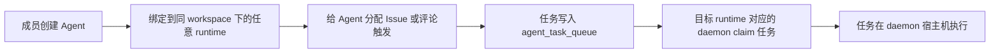

这意味着问题不在于“是否能直接登录别人的电脑”，而在于：

- 可以借用别人的 runtime 作为执行环境
- 可以让任务在别人启动 daemon 的机器上运行
- 如果该机器具备本地代码、凭据、工具链、内网访问能力，则风险会被进一步放大

### 11.3 风险分解

| 风险点 | 说明 |
|---|---|
| 本地代码访问 | Agent 会在 runtime 关联的本地工作目录/仓库环境中执行 |
| 本地凭据继承 | daemon 进程所在机器可能已有 Git、云厂商、模型平台等登录态 |
| MCP/本地工具调用 | Agent 可能复用 runtime 所在环境已安装的 CLI、脚本、MCP 配置 |
| 资源消耗 | 普通成员可间接消耗他人机器的 CPU、网络、磁盘、模型配额 |
| 安全边界混淆 | UI 中看到的是“我的 agent”，实际执行位置却可能是“别人的宿主机” |

### 11.4 当前代码中的权限现状

| 能力 | owner/admin | member |
|---|---|---|
| 查看 workspace 内全部 runtime | Y | Y |
| 创建 agent 绑定自己的 runtime | Y | Y |
| 创建 agent 绑定别人的 runtime | Y | **Y（当前实现允许）** |
| 更新 agent 改绑别人的 runtime | Y | **Y（当前实现允许）** |
| 删除别人的 runtime | Y | N |

这说明当前系统对 runtime 的权限控制是分裂的：

- 在“删除”维度上，runtime 被视为带 owner 的个人资源
- 在“Agent 绑定执行”维度上，runtime 又被视为 workspace 共享资源

这两个语义目前并不一致。

### 11.5 建议的更合理模型

建议将“谁能绑定 runtime”与“谁能删除 runtime”统一到同一条权限语义上：

| 操作 | owner/admin | member |
|---|---|---|
| 绑定自己的 runtime | Y | Y |
| 绑定别人的 runtime | Y | N |
| 删除自己的 runtime | Y | Y |
| 删除别人的 runtime | Y | N |

对应后端最小改动点通常是：

- `CreateAgent`
- `UpdateAgent`

在已通过 `GetAgentRuntimeForWorkspace` 校验后，再增加一层：

- 若当前用户不是 workspace owner/admin
- 则要求 `runtime.owner_id == current_user_id`

否则直接返回 `403 Forbidden`

### 11.6 与评论触发问题的关系

评论触发和 runtime 绑定是两个不同层面的问题：

- 评论触发解决的是“什么时候入队”
- runtime 绑定解决的是“入队后在哪台机器执行”

两者组合后，才形成完整的执行路径：

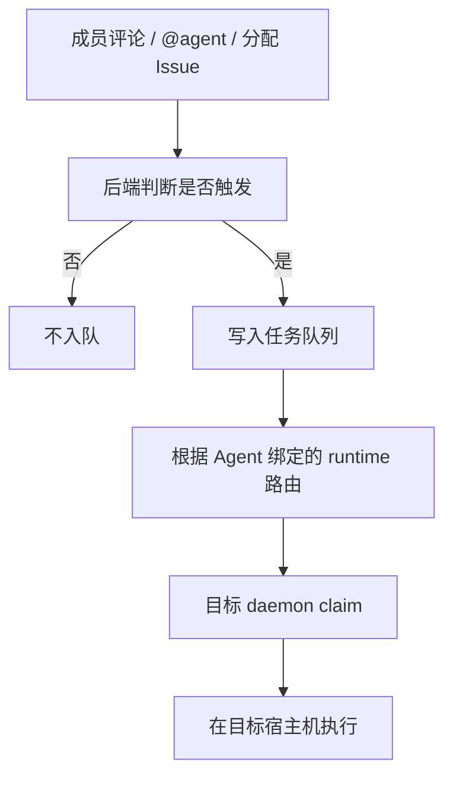

因此，即使评论触发规则本身没问题，只要 runtime 绑定权限过宽，仍然可能把任务送到不该使用的宿主机。

### 11.7 上游 GitHub 讨论线索

目前未发现一个**直接**描述“member 可以把 agent 绑定到别人 runtime，导致任务在别人电脑执行”的独立 issue，但已存在两类强相关讨论：

| 类型 | 链接 | 说明 |
|---|---|---|
| PR | [multica-ai/multica#534](https://github.com/multica-ai/multica/pull/534) | 给 `agent_runtime` 增加 `owner_id`，并实现 Mine/All 过滤与删除权限，但未收紧 Agent 绑定权限 |
| PR | [multica-ai/multica#324](https://github.com/multica-ai/multica/pull/324) | 调整 private/workspace agent 的可见性、mention 与管理权限，没有涉及 runtime 绑定边界 |
| Issue | [multica-ai/multica#1114](https://github.com/multica-ai/multica/issues/1114) | 明确指出“workspace member 可以创建 agent”会把 `custom_env` 注入 daemon host 子进程，形成宿主机安全风险 |
| Issue | [multica-ai/multica#1113](https://github.com/multica-ai/multica/issues/1113) | 同样把“workspace member 可以创建 agent”作为安全问题前提，说明上游已开始关注这一边界 |

从这些讨论可以推断：

- 上游已经意识到“agent 配置会影响 daemon host”这一安全面
- 也已经给 runtime 建立了 `owner_id` 概念
- 但尚未把“runtime owner”真正纳入 Agent 绑定权限判定

---

## 12. 各 Agent CLI 接入机制

### 12.1 总体思路

Multica 对接不同 Agent CLI 的方式，不是为每个 CLI 单独实现一套完整业务流程，而是拆成两层统一适配：

- 第一层：`server/pkg/agent/` 负责把不同 CLI 适配成统一的 Backend 接口
- 第二层：`server/internal/daemon/execenv/` 负责把 Multica 运行时上下文注入到各家 CLI 的“原生发现机制”里

这样服务端只需要维护一套任务协议：

- 领取任务
- 启动 Agent
- 接收流式消息
- 回写最终结果

而不需要关心底层到底是 Claude、Codex、Hermes、Copilot 还是 OpenCode。

### 12.2 统一接入总览

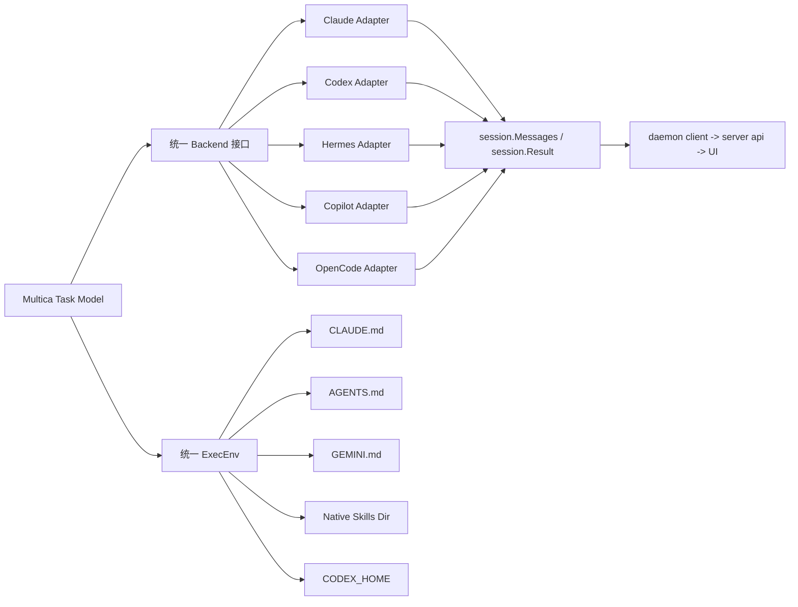

可以把它理解成一个“双适配器”模型：

- `Backend` 解决“怎么调用各家 CLI、怎么解析它们的输出”
- `ExecEnv` 解决“怎么让各家 CLI 发现 Multica 注入的上下文、技能和工作流约束”

### 12.3 统一回写链路

Daemon 在执行任务时，会把不同 CLI 的输出统一收敛成一套内部消息模型，然后通过 daemon API 回写给服务端。

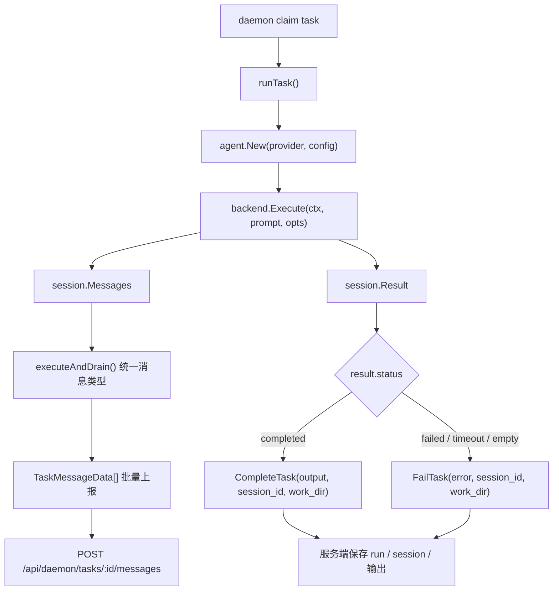

这一层的关键特征是“统一协议，不统一 CLI 本身”：

- 不同 provider 可以有不同启动方式、不同流式协议
- 但最终都要产出统一的 `session.Messages`
- 以及统一的 `session.Result`

Daemon 进一步把消息规整成以下几类：

- `text`
- `thinking`
- `tool_use`
- `tool_result`
- `error`

然后按批次上报给服务端，而不是每条消息立刻发一次请求。

### 12.4 统一回写链路中的关键设计

| 设计点 | 说明 |
|---|---|
| 批量 flush | `executeAndDrain()` 以固定节奏批量发送消息，降低回写开销 |
| 消息归一化 | 无论底层 CLI 原始格式如何，回写前统一为 `TaskMessageData` |
| 结果独立上报 | 最终结果通过 `CompleteTask` / `FailTask` 单独提交 |
| 使用量单独上报 | token usage 不依赖任务成功与否，单独走 `ReportTaskUsage` |
| 保留恢复信息 | 即使失败/超时，也尽量回传 `session_id` 与 `work_dir`，方便下次 resume |

这套设计意味着：

- UI 看到的是统一消息流
- Server 保存的是统一任务轨迹
- Daemon 可以自由适配新的 CLI，而不需要改动整个任务模型

### 12.5 运行时上下文注入链路

CLI 能不能“像在原生环境里一样工作”，关键取决于 daemon 如何准备执行目录和配置文件。

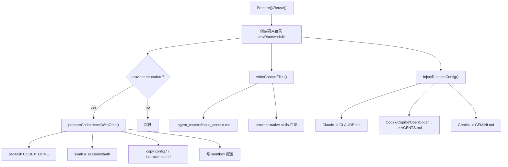

这里的重点不是简单写一个 prompt 文件，而是构造一个“临时工作目录 + provider 原生配置入口”的组合环境。

### 12.6 Daemon 注入了哪些上下文

每个任务会得到一个独立的执行目录，通常包含：

- `workdir/`
- `output/`
- `logs/`
- `.agent_context/issue_context.md`

其中 `.agent_context/issue_context.md` 会写入最基础的任务上下文，例如：

- 当前 issue ID
- 当前触发方式（assignment 或 comment trigger）
- 触发 comment ID
- 快速获取 issue 详情的 `multica` CLI 命令
- 当前 agent 已安装 skills 列表

除此之外，daemon 还会额外写入 provider 对应的顶层配置文件：

| Provider | 顶层配置文件 |
|---|---|
| Claude | `CLAUDE.md` |
| Codex | `AGENTS.md` |
| Copilot | `AGENTS.md` |
| OpenCode | `AGENTS.md` |
| OpenClaw | `AGENTS.md` |
| Gemini | `GEMINI.md` |
| Pi / Cursor / Kimi | `AGENTS.md` |

这些文件不是普通说明文档，而是 Multica 的“运行时元指令”。

### 12.7 `AGENTS.md` / `CLAUDE.md` 实际承载的内容

`InjectRuntimeConfig()` 写入的内容非常重，核心上包含：

- Agent 身份信息
- Agent 的 persona / instructions
- 允许使用的 `multica` CLI 命令清单
- 读取 issue / comment / workspace / agent / autopilot 的命令
- 写入 issue / comment / status 的命令
- 可 checkout 的 repository 列表
- comment-trigger 工作流
- assignment-trigger 工作流
- 回复评论时必须带正确 `--parent <triggerCommentID>`
- mention 语法
- 附件下载方式
- “最终结果必须通过 issue comment 回传”的硬约束

因此它不只是“让 CLI 知道要做什么”，而是在运行期动态生成了一份面向该 task 的操作手册。

### 12.8 Skills 注入方式对照

Multica 不强迫所有 CLI 使用同一个 skills 路径，而是尽量贴合各家 CLI 的原生约定。

| Provider | Skills 注入位置 | 说明 |
|---|---|---|
| Claude | `.claude/skills/<name>/SKILL.md` | 走 Claude Code 原生项目级 skills 发现 |
| Codex | `CODEX_HOME/skills/<name>/SKILL.md` | 不走 workdir，走单独的 per-task `CODEX_HOME` |
| Copilot | `.github/skills/<name>/SKILL.md` | 借用 Copilot 项目级 skills 机制 |
| OpenCode | `.config/opencode/skills/<name>/SKILL.md` | 走 OpenCode 原生目录 |
| Pi | `.pi/agent/skills/<name>/SKILL.md` | 走 Pi 原生目录 |
| Cursor | `.cursor/skills/<name>/SKILL.md` | 走 Cursor 原生目录 |
| Kimi | `.kimi/skills/<name>/SKILL.md` | 走 Kimi Code 原生目录 |
| 默认回退 | `.agent_context/skills/<name>/SKILL.md` | 供未知 provider 或非原生技能发现模式使用 |

这说明 Multica 的设计原则是：

- 优先适配 provider 的原生技能发现方式
- 只有在没有原生约定时，才回退到 `.agent_context/skills/`

### 12.9 各 Agent CLI 接入方式对照

| Provider | 主要接入方式 | 配置入口 | Skills 注入 | 特殊点 |
|---|---|---|---|---|
| Claude | CLI + 流式 JSON | `CLAUDE.md` | `.claude/skills/` | 按 Claude Code 的项目约定接入 |
| Codex | `codex app-server --listen stdio://` | `AGENTS.md` | `CODEX_HOME/skills/` | 使用单独的 per-task `CODEX_HOME` |
| Hermes | ACP 协议适配 | `AGENTS.md` | 回退或 provider 约定 | 更像协议桥接层 |
| Copilot | CLI | `AGENTS.md` | `.github/skills/` | 复用 GitHub Copilot 的项目级技能机制 |
| OpenCode | CLI | `AGENTS.md` | `.config/opencode/skills/` | 复用 OpenCode 原生技能目录 |

从架构角度看，这几类 provider 的共同点是：

- 都被包装进统一的 Backend 抽象
- 都在执行前拿到统一的 task context
- 都通过统一 daemon API 回写消息和最终结果

区别主要只在三处：

- 启动命令不同
- 流式消息协议不同
- 原生配置/skills 发现路径不同

### 12.10 Codex 的特殊处理

Codex 是当前接入里最“深”的一个，因为它除了读 `AGENTS.md`，还会被注入单独的 `CODEX_HOME`。

这个 per-task `CODEX_HOME` 的设计意图是：

- 让不同任务拥有隔离的 Codex 运行配置
- 又不丢失用户共享的认证和 sessions

具体做法是：

- symlink 共享 `sessions/`
- symlink 共享 `auth.json`
- copy `config.json`
- copy `config.toml`
- copy `instructions.md`
- 再由 daemon 覆写或补充 sandbox 配置

所以 Codex 的接法并不是“只靠 prompt”和“只靠工作目录”，而是已经深入到 CLI 的 home 目录级别。

### 12.11 这一层和权限/安全问题的关系

Agent CLI 的接入机制本身不是权限问题，但它决定了“任务真正在哪个环境执行、继承哪些上下文”。

因此一旦结合前面 runtime 归属问题，就会形成完整的执行闭环：

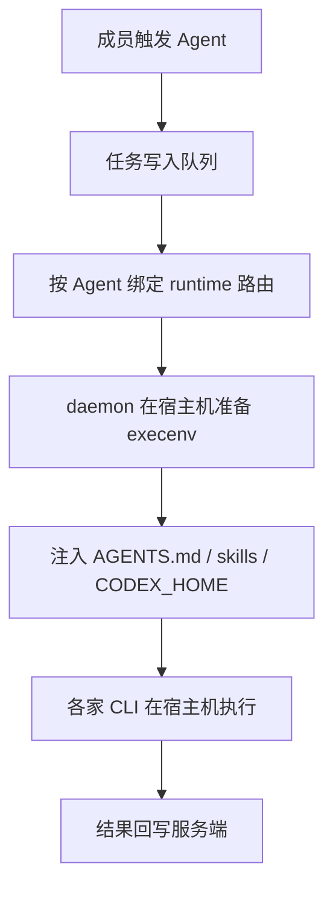

也就是说：

- “谁触发任务”决定任务是否入队
- “Agent 绑定哪个 runtime”决定任务落到哪台宿主机
- “execenv 注入了什么”决定该任务在宿主机上能看到什么运行上下文

所以这部分架构分析，实际上正好补足了前面权限问题的最后一环。

### 12.12 会话复用机制

Multica 对 Agent CLI 的调用，并不总是“每次都开一个全新会话”。

当前实现中，系统会尽量复用上一轮任务已经建立好的 `session_id` 和 `work_dir`，让下一次执行延续上下文。

可以分成两类：

| 场景 | 复用键 | 说明 |
|---|---|---|
| Issue 任务 | `(agent_id, issue_id)` | 同一个 Agent 在同一个 Issue 上，优先复用最近一次已完成任务的会话 |
| Chat 任务 | `chat_session_id` | 同一个聊天会话持续复用同一条 session 指针 |

其基本链路如下：

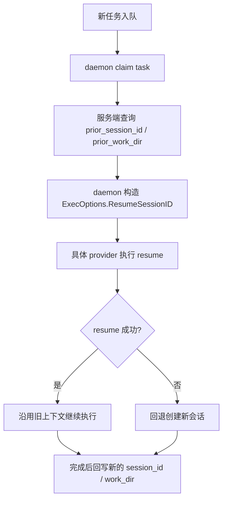

这说明 Multica 的策略并不是“强制必须复用”，而是：

- 能复用就复用
- 复用失败时回退为新会话
- 再把新的 `session_id` 持久化，供下一轮继续使用

### 12.13 Issue 模式与 Chat 模式的区别

#### Issue 模式

Issue 模式下，服务端会查询：

- 同一个 `agent_id`
- 同一个 `issue_id`
- 最近一次 `status = completed`
- 且 `session_id IS NOT NULL`

如果找到，就把它作为下一轮任务的：

- `PriorSessionID`
- `PriorWorkDir`

这意味着：

- 同一个 Agent 在同一个 Issue 上，评论触发、重复分配、继续跟进时，有机会延续之前的上下文
- 但换一个 Agent，或者换一个 Issue，通常不会共享会话

#### Chat 模式

Chat 模式更强调持续对话，因此优先级更高：

1. 优先使用 `chat_session.session_id`
2. 如果它为空，再回退到该聊天最近一次任务记录下来的 `session_id`

而且在任务完成或失败时，系统会把新的 `session_id` / `work_dir` 写回：

- `agent_task_queue`
- `chat_session`

这样下一条聊天消息才能真正延续上一次对话，而不是重新开新上下文。

### 12.14 各 Provider 如何执行 resume

虽然 Multica 对外表现成统一的“会话复用”，但底层不同 CLI 的 resume 方式并不一样。

| Provider | 恢复方式 | 说明 |
|---|---|---|
| Claude | `--resume <session_id>` | 直接把上一次会话 ID 传给 Claude CLI |
| Codex | `thread/resume` | 通过 app-server JSON-RPC 恢复 thread，失败再 `thread/start` |
| Copilot | `--resume <session_id>` | CLI 级 resume |
| OpenCode | `--session <session_id>` | 把 session 标识传给 OpenCode CLI |
| Gemini | `-r <session_id>` | CLI 级 resume |
| Cursor | `--resume <session_id>` | CLI 级 resume |
| Hermes | `session/resume` | 通过 ACP 协议恢复会话 |
| Kimi | `session/resume` | 通过 ACP 协议恢复会话 |
| Pi | `--session <path>` | 复用的不是抽象 ID，而是 session 文件路径本身 |

其中 Codex 的行为最典型：

- 先尝试 `thread/resume`
- 如果线程不存在、协议不兼容或恢复失败
- 自动回退到 `thread/start`

因此“有复用能力”并不等于“每次都一定落到同一个旧 session 上”。

### 12.15 本地能否看到这些会话

这里要先明确，“本地”指的是 **runtime 所在的宿主机**，不是发起操作的用户浏览器，也不一定是当前这台电脑。

如果 Agent 绑定的是你的 runtime，那么：

- 会话文件、日志、workdir 很大概率落在你的机器上

如果 Agent 绑定的是别人的 runtime，那么：

- 会话文件、日志、workdir 会落在别人的宿主机上
- 你在自己电脑上未必能直接看到这些原始文件

也就是说，**会话的“逻辑归属”在 Multica 平台内，而“物理落盘位置”取决于 runtime 宿主机**。

### 12.16 哪些 Provider 的本地会话文件位置是明确可见的

从当前仓库代码可以明确看出的，有两类：

| Provider | 本地路径 | 说明 |
|---|---|---|
| Codex | `~/.codex/sessions/YYYY/MM/DD/*.jsonl` 或 `$CODEX_HOME/sessions/...` | 代码中会主动扫描这些 JSONL 统计 usage |
| Pi | `~/.multica/pi-sessions/*.jsonl` | Pi 直接把 session 文件路径本身作为可复用 session 标识 |

其中 Codex 还有一个额外特性：

- Multica 会为每个 task 准备一个 per-task `CODEX_HOME`
- 但其中的 `sessions/` 会 symlink 回共享的 `~/.codex/sessions`

因此即使 task 目录隔离，Codex 的 session 日志通常仍然能在共享 home 下看到。

### 12.17 哪些 Provider 在当前仓库中只看得到“逻辑 session_id”

对于以下 provider，从当前 Multica 代码中可以确认：

- 系统会保存并复用它们的 `session_id`
- 但仓库里没有统一管理其原始 session 文件落盘路径的逻辑

包括：

- Claude
- Copilot
- OpenCode
- Gemini
- Cursor
- Hermes
- Kimi

这意味着：

- 在 Multica 这一层，你能看到“是否在复用 session”
- 但如果要看这些 CLI 自己的底层会话文件，还要依赖各自 CLI 的实现和宿主机本地目录规则

### 12.18 这和权限问题的联系

会话复用本身是为了连续性和上下文保留，但它也进一步说明了 runtime 权限为什么敏感：

- 任务不只是“瞬时在某台机器上跑一下”
- 它还可能持续复用那台机器上的 `work_dir`
- 持续复用那台机器上建立过的 agent session
- 持续读取那台机器上的上下文、技能目录、认证目录或日志目录

因此，如果 member 可以把 agent 绑定到别人的 runtime，问题就不只是“一次任务借用别人的电脑”，而是可能形成一个**持续复用别人宿主环境的长会话执行链路**。

### 12.19 Repositories 的处理机制

Multica 对 `Repositories` 的处理，不是“任务启动时自动把代码挂载进来”，而是采用三段式模型：

- Workspace 维护 repo 元数据清单
- Daemon 在宿主机维护 bare clone cache
- Agent 在真正需要代码时，显式执行 `multica repo checkout <url>`

也就是说，repo 在系统里的语义更接近：

- “该 workspace 允许访问哪些代码仓库”

而不是：

- “每次任务启动时自动把这些仓库都 clone 到当前目录”

### 12.20 总体链路

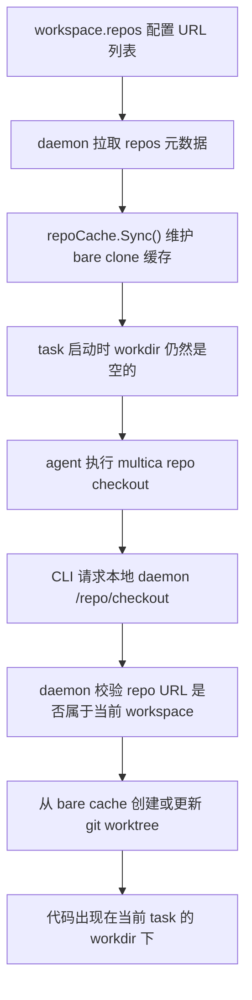

这个设计的核心是：

- repo 元数据和实际代码副本分离
- 代码 checkout 延迟到真正需要时再发生
- 多个任务共享 bare cache，减少重复 clone

### 12.21 Workspace 中保存的是什么

Workspace 里的 `repos` 字段，保存的是一组仓库元数据，通常包含：

- `url`
- `description`

这些数据的主要作用是：

- 告诉 daemon 当前 workspace 允许访问哪些 repo
- 在 `AGENTS.md` / `CLAUDE.md` 中向 agent 展示有哪些 repo 可供 checkout

但它本身不是本地代码副本，也不是任务启动时自动注入到 workdir 的目录。

### 12.22 Daemon 的 bare cache

Daemon 会把 workspace 里的 repo 列表同步到本机 bare cache。

对于每个 repo：

- 如果本地没有缓存：执行 `git clone --bare`
- 如果已经有缓存：执行 `git fetch origin`

其目的不是直接给 task 使用，而是作为后续创建 worktree 的共享源。

这种设计有两个直接收益：

- 多个任务不需要重复 clone 同一个远程仓库
- 同一 workspace 的多个 Agent/任务可以共享对象存储和 refs

### 12.23 Task 启动时不会自动 checkout

`execenv` 在为任务准备工作目录时，会把 repo 作为上下文信息写进运行时配置，让 agent 知道：

- 当前 workspace 有哪些 repo
- 可以通过什么命令把 repo checkout 到当前目录

但 `workdir` 初始仍然是空的，不会自动出现仓库代码。

这意味着：

- 只有当 agent 判断“这次任务确实需要代码”时
- 才会主动执行 `multica repo checkout <url>`

因此 repo checkout 是按需触发的，而不是任务生命周期的一部分默认动作。

### 12.24 `multica repo checkout <url>` 实际做了什么

当 agent 在任务中执行：

```bash
multica repo checkout <url>
```

它并不是直接在当前 shell 里自己跑 `git clone`，而是：

1. 读取当前环境变量中的：
   - `MULTICA_DAEMON_PORT`
   - `MULTICA_WORKSPACE_ID`
   - `MULTICA_AGENT_NAME`
   - `MULTICA_TASK_ID`
2. 获取当前 `workdir`
3. 向本机 daemon 发起：
   - `POST /repo/checkout`
4. 由 daemon 在宿主机上完成：
   - repo 合法性校验
   - bare cache 准备
   - worktree 创建或更新

所以 `repo checkout` 实际上是：

- agent 发起请求
- daemon 代为落地执行 git 相关操作

### 12.25 真正出现在 task 目录里的是 worktree

Daemon 不会把 bare cache 直接暴露给 agent，而是从 bare repo 派生出一个工作树放进当前 task 的 `workdir`。

创建新 worktree 时，大致会：

- `git fetch`
- 解析远程默认分支
- 生成分支名：`agent/<agent-name>/<short-task-id>`
- 执行 `git worktree add -b ...`

因此 task 目录里看到的是：

- 一个可编辑的普通 git 工作树

而不是：

- 一个 bare repo
- 或完整重新 clone 的独立仓库副本

### 12.26 worktree 是否会复用

如果当前 task 的 `workdir` 已经存在这个 repo 对应的 worktree，daemon 不会一律重新创建，而是尝试复用并清理。

大致处理过程是：

- `git reset --hard`
- `git clean -fd`
- 从默认分支重新切一个新 branch

这说明：

- `workdir` 复用时，repo 目录也可能被复用
- 但不会保留上一次 task 留下的未提交修改或临时文件

从设计目标看，它追求的是：

- 保留目录级复用带来的性能收益
- 但把工作树重置回干净状态，避免旧任务污染新任务

### 12.27 `description` 的真实作用

很多人会误以为 agent 是否 checkout 某个 repo，是根据 `description` 决定的。

实际上并不是。

`description` 的作用主要是：

- 帮助 agent 理解这个 repo 是做什么的
- 帮助人类在 workspace 配置中识别 repo

例如：

- `frontend web`
- `backend api`
- `mobile app`

这些描述可以帮助 agent 推理“应该 checkout 哪个 repo”，但它们不参与系统权限判定，也不参与真正的 checkout 校验。

### 12.28 真正参与校验的是 URL

系统真正用于权限和路由判断的，是 `repo URL`。

也就是说：

- allowlist 按 URL 建立
- bare cache 按 URL 建立
- `repo checkout` 按 URL 请求
- daemon 校验 repo 是否允许，也按 URL 判断

可以理解为：

- `description` 是给人和 agent 看的语义标签
- `url` 才是系统真正识别 repo 的主键

### 12.29 这和安全边界的关系

Repositories 这一层的安全边界体现在两点：

1. agent 不能随意 checkout 任意外部 repo  
   只有 workspace 配置过的 URL 才允许 checkout

2. 代码副本实际落在哪台机器上，仍由 runtime 决定  
   即使 repo allowlist 是 workspace 级的，最终 checkout 和 worktree 创建仍发生在绑定 runtime 的宿主机上

因此 repo 机制本身是“按 workspace 授权、按 runtime 落地”的。

如果再叠加前面 runtime 绑定权限过宽的问题，就会出现这样一种组合风险：

- repo 访问权限来自当前 workspace
- 但代码 checkout 和执行环境却可能落到别人机器上

这也是为什么 `Repositories`、`Runtime`、`Session Resume` 三部分需要放在一起看，才能看清完整的执行边界。

---

## 13. 结论

Multica 的架构已经形成清晰的工程分界：

- 后端负责权限闭环、多租户隔离、任务编排与实时同步
- 前端通过 core/views/ui 分层保障跨平台一致性与可维护性
- Agent 与人类成员在任务域中统一抽象，支持 AI-first 的产品形态

这套设计适合中小团队高频协作与 AI 自动化落地，且具备继续向企业级治理能力扩展的基础。

但从当前实现看，**runtime 归属语义与 agent 绑定语义尚未完全对齐**。如果继续面向多人协作与真实宿主机执行环境演进，这一处应被视为优先级较高的权限收口点。
