# Multica 项目架构与权限深度分析

## 阅读导航

这篇文档现在按“先全局、再主链路、再风险”的顺序组织。不同读者可以按下面的路径阅读：

| 读者角色 | 推荐阅读章节 | 阅读目的 |
|---|---|---|
| 产品 / 项目负责人 | `1`、`2`、`5`、`13` | 快速理解系统目标、整体结构、关键链路和最终结论 |
| 前端 / 全栈开发 | `2`、`3`、`4`、`5`、`12` | 理解 monorepo 分层、前后端协作方式和实时同步模型 |
| 后端 / 平台开发 | `4`、`5`、`6`、`7`、`8`、`10` | 理解任务模型、权限边界、daemon 执行路径和 repo 处理机制 |
| Agent / Runtime 相关开发 | `7`、`8`、`9`、`10`、`11` | 理解 CLI 接入、session 复用、repo checkout 和 runtime 风险 |
| 安全 / 审计 / 治理角色 | `6`、`9`、`10`、`11`、`12`、`13` | 重点查看租户隔离、宿主机执行边界、repo 边界和权限收口建议 |

如果只想在 5 分钟内抓住最关键的问题，建议直接看：

1. `7. Agent / Runtime / Daemon 执行架构`
2. `10. Repositories 处理机制`
3. `11. 运行时归属与执行风险`
4. `13. 结论`

## 1. 项目定位与目标

Multica 是一个 AI 原生任务协作平台，核心理念是让 AI Agent 成为团队中的一等执行者，而不是外部插件。系统目标包括：

- 支持多人、多工作空间（workspace）协作
- 支持 Agent 被分配 Issue、执行任务、回传结果
- 提供 Web 与 Desktop 双端一致的业务体验
- 通过实时事件（WebSocket）保持多端状态同步

从工程实现看，这个项目不是单纯的“聊天套壳”或“代码 Agent 外挂”，而是把：

- 人类成员
- Agent
- Runtime / Daemon
- Issue / Comment / Chat

都放进同一个协作模型里统一编排。

---

## 2. 总体架构

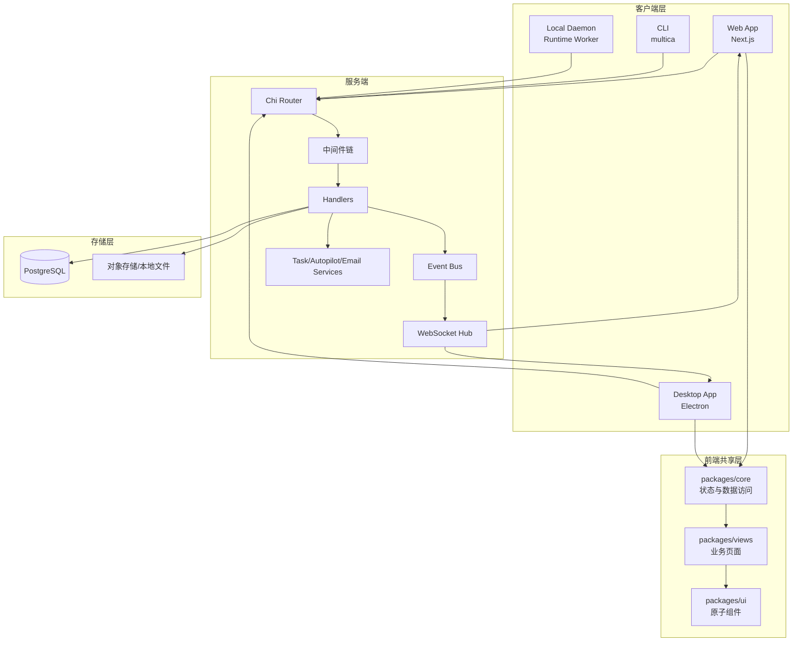

这套架构的关键点在于：

- Web、Desktop、CLI、Daemon 都通过同一套后端协议协作
- 前端业务能力通过 monorepo 共享
- 后端既处理普通业务接口，也承担 Agent 调度和实时广播
- Runtime/Daemon 是“执行面”，不直接承载最终业务权限判定

---

## 3. Monorepo 与前后端分层

### 3.1 目录职责

| 路径 | 职责 | 关键约束 |
|---|---|---|
| `server/` | Go 后端 API、WebSocket、Daemon 协议、数据库访问 | 业务权限和多租户校验在这里闭环 |
| `apps/web/` | Next.js Web 应用 | App Router，平台特有逻辑仅在 web 侧 |
| `apps/desktop/` | Electron 桌面应用 | Tab 系统、Window Overlay、桌面平台桥接 |
| `packages/core/` | 共享业务逻辑与状态层 | 不依赖 react-dom，不直接使用 localStorage |
| `packages/views/` | 共享业务页面与复合组件 | 不依赖 `next/*` 与 `react-router-dom` |
| `packages/ui/` | 原子 UI 组件与样式 token | 不引入业务逻辑 |

### 3.2 前端状态架构

- React Query：管理服务器状态（issues、members、agents、inbox、projects 等）
- Zustand：管理客户端状态（UI 过滤、当前选中、Tab/Overlay 状态、草稿）
- WebSocket 事件：触发 Query Invalidation，而不是直接写入业务 store

### 3.3 后端分层结构

| 层级 | 核心目录 | 说明 |
|---|---|---|
| 入口层 | `server/cmd/server` | HTTP 启动、路由装配、监听器注册 |
| 接口层 | `server/internal/handler` | 各业务模块 HTTP Handler |
| 中间件层 | `server/internal/middleware` | Auth、Workspace、DaemonAuth、CSP、日志 |
| 领域服务层 | `server/internal/service` | 任务调度、自动化触发、邮件等 |
| 事件层 | `server/internal/events` | 同步事件总线 |
| 实时层 | `server/internal/realtime` | WebSocket Hub 广播 |
| 数据访问层 | `server/pkg/db/generated` | sqlc 生成强类型查询 |
| 数据定义层 | `server/migrations` | 表结构演进 |

### 3.4 中间件职责

| 中间件 | 作用 |
|---|---|
| RequestID | 生成请求追踪 ID |
| RequestLogger | 记录 method/path/status/duration |
| Recoverer | panic 恢复 |
| ContentSecurityPolicy | 安全响应头 |
| CORS | 跨域控制 |
| Auth | 校验 JWT/PAT/Cookie 并注入用户上下文 |
| RequireWorkspaceMember / Role | 校验 workspace 成员与角色权限 |
| DaemonAuth | 校验 `mdt_*` daemon token |

这一层决定了一个非常重要的边界：

- 前端负责展示和交互
- Daemon 负责执行
- 真正的权限闭环仍然在后端 handler + middleware + SQL 过滤

---

## 4. 数据模型与核心功能

### 4.1 核心功能矩阵

| 功能域 | 核心能力 | 后端模块 | 前端模块 |
|---|---|---|---|
| 认证 | Magic Code、Google OAuth、CLI Token | auth handler + auth middleware | auth 页面 + auth store |
| Workspace | 创建、查询、更新、删除、离开 | workspace handler | workspace 页面/切换逻辑 |
| 邀请 | 发起邀请、接受、拒绝、撤销 | invitation handler | invite 页面/弹层 |
| Issues | CRUD、批量更新、子任务、依赖、搜索 | issue handler | issues page/list/board/detail |
| Comments | 评论、编辑、删除、反应、提及 | comment/reaction handler | issue detail comments |
| Projects | 项目 CRUD、搜索 | project handler | project pages |
| Agents | Agent CRUD、归档恢复、技能绑定 | agent handler | agents 管理页面 |
| Skills | Skill CRUD、文件管理、导入 | skill handler | skills 管理页面 |
| Runtime/Daemon | runtime 状态、任务领取与回报 | daemon/runtime/task handler | runtimes 页面 |
| Autopilot | 规则定义、触发、执行记录 | autopilot handler/service | autopilot 页面 |
| Inbox | 通知列表、已读、归档 | inbox handler | inbox 页面 |
| Chat | 会话、消息、待处理任务 | chat handler | chat 组件 |
| 附件 | 上传、读取、删除 | file/attachment handler | issue attachment UI |

### 4.2 核心实体关系

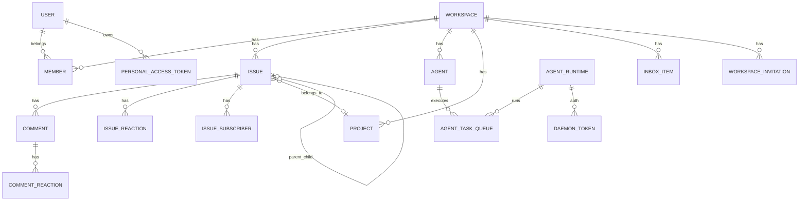

核心表包括：

- `user`
- `workspace`
- `member`
- `issue`
- `comment`
- `project`
- `agent`
- `agent_runtime`
- `agent_task_queue`
- `inbox_item`
- `workspace_invitation`
- `personal_access_token`
- `daemon_token`

这些实体中，后续分析最关键的是四组关系：

- `workspace -> member`
- `workspace -> agent`
- `agent -> runtime`
- `agent / runtime -> agent_task_queue`

---

## 5. 核心业务时序

### 5.1 登录（Magic Code）

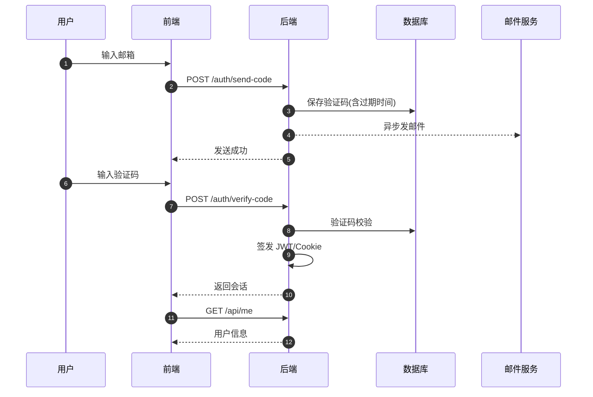

### 5.2 创建 Workspace

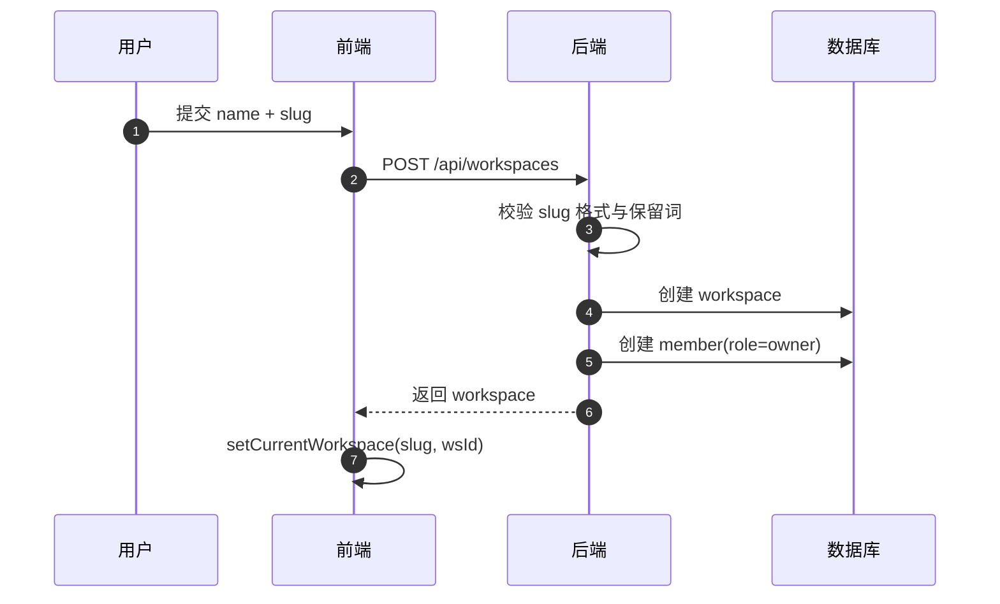

### 5.3 Issue 创建与实时同步

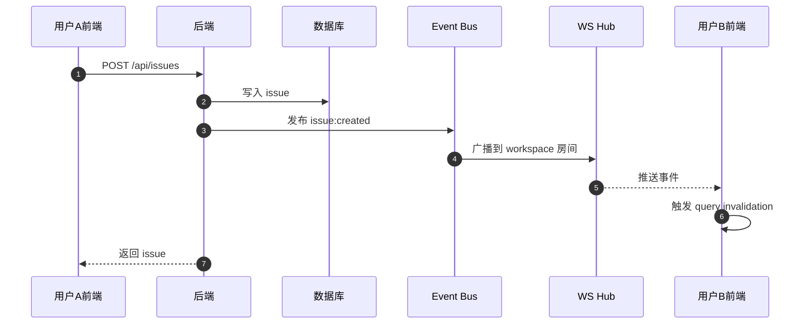

### 5.4 Agent 任务执行主链路

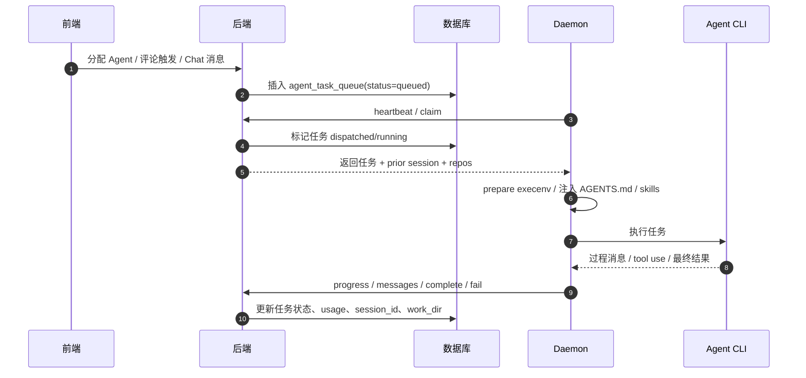

### 5.5 邀请成员流程

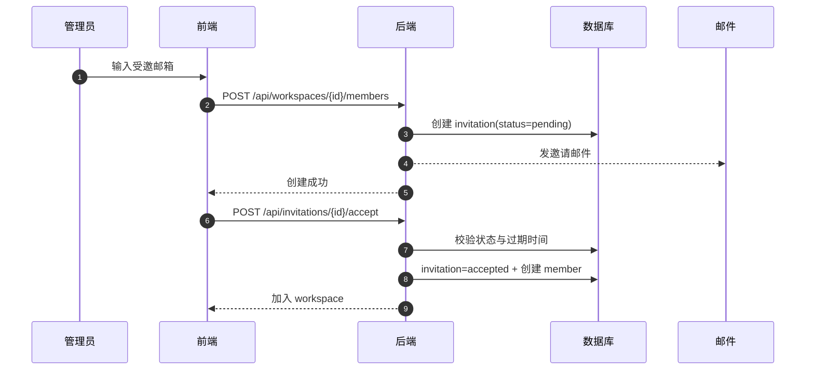

### 5.6 Desktop 跨 Workspace 切换

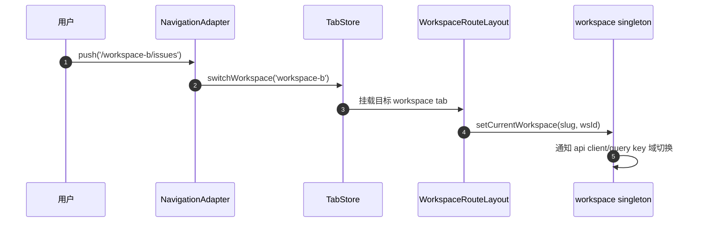

---

## 6. 权限模型与租户隔离

### 6.1 角色定义

- owner：工作空间所有者，拥有最高权限
- admin：管理者，拥有大部分管理权限，但受 owner 边界限制
- member：普通成员，可参与业务操作但无成员管理权限
- agent：执行身份，通过 agent/daemon 流程触发任务，不是人类管理角色

### 6.2 权限表（工作空间内）

| 操作 | owner | admin | member | agent/daemon |
|---|:---:|:---:|:---:|:---:|
| 查看 workspace | Y | Y | Y | Y(受限) |
| 更新 workspace | Y | Y | N | N |
| 删除 workspace | Y | N | N | N |
| 邀请成员 | Y | Y | N | N |
| 撤销邀请 | Y | Y | N | N |
| 修改成员角色 | Y | N | N | N |
| 移除成员 | Y | N | N | N |
| Issue 创建/更新 | Y | Y | Y | Y(通过任务通道) |
| Issue 删除 | Y | Y | 部分(通常限作者/规则) | N |
| 评论创建 | Y | Y | Y | Y |
| 评论修改/删除 | Y | Y | 作者范围 | 作者范围 |
| Agent 管理 | Y | Y | 部分(创建等) | N |
| Skill 管理 | Y | Y | Y | N |
| Runtime 管理 | Y | Y | Y | daemon 自身上报 |

### 6.3 资源隔离机制

- 每个 workspace 独立业务域
- 请求通过 `X-Workspace-Slug` 或 `X-Workspace-ID` 解析目标 workspace
- 中间件先校验成员身份与角色
- SQL 查询按 `workspace_id` 过滤
- 双层隔离避免跨租户数据串读

这一层是后面所有“Agent 能不能做某事”“Runtime 能不能被绑定”的前提。

---

## 7. Agent / Runtime / Daemon 执行架构

### 7.1 核心角色

| 角色 | 作用 |
|---|---|
| Agent | 逻辑执行者，承载技能、指令、模型配置、runtime 绑定 |
| Runtime | 物理执行入口，对应某个 daemon 宿主环境 |
| Daemon | 本地常驻进程，claim task、准备环境、启动 CLI、回写结果 |
| Agent Task Queue | 统一任务队列，承接 issue / comment / chat / autopilot 等触发 |

### 7.2 执行主链路

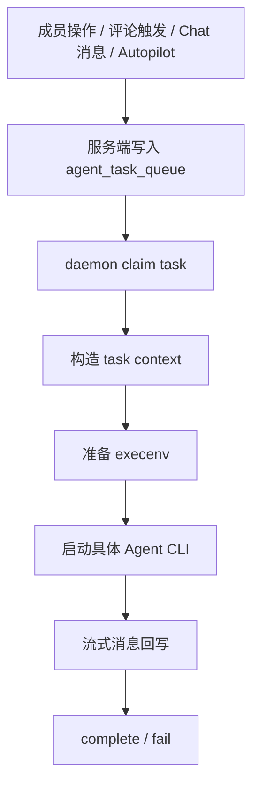

### 7.3 触发与执行是两层逻辑

需要明确区分两件事：

1. 什么时候入队  
   由 comment/issue/chat/autopilot 的业务规则决定

2. 入队后在哪执行  
   由 Agent 绑定的 runtime 决定

这也是为什么评论触发问题和 runtime 权限问题必须一起看。

### 7.4 Task 上下文中真正关键的字段

当 daemon claim 一个 task 时，返回信息里最重要的是：

- `workspace_id`
- `agent_id`
- `runtime_id`
- `prior_session_id`
- `prior_work_dir`
- `repos`
- `trigger_comment_id`
- `chat_session_id`

它们分别决定：

- 去哪个 workspace 上下文里执行
- 以哪个 agent 身份执行
- 落到哪台 runtime 宿主机
- 是否复用旧会话
- 是否复用旧 workdir
- 可以 checkout 哪些 repo
- 是否需要按 comment thread 回复
- 是否属于持续 chat 会话

---

## 8. Agent CLI 接入机制

### 8.1 总体思路

Multica 对接不同 Agent CLI 的方式，不是为每个 CLI 单独实现一套完整业务流程，而是拆成两层统一适配：

- 第一层：`server/pkg/agent/` 负责把不同 CLI 适配成统一的 Backend 接口
- 第二层：`server/internal/daemon/execenv/` 负责把 Multica 运行时上下文注入到各家 CLI 的原生发现机制里

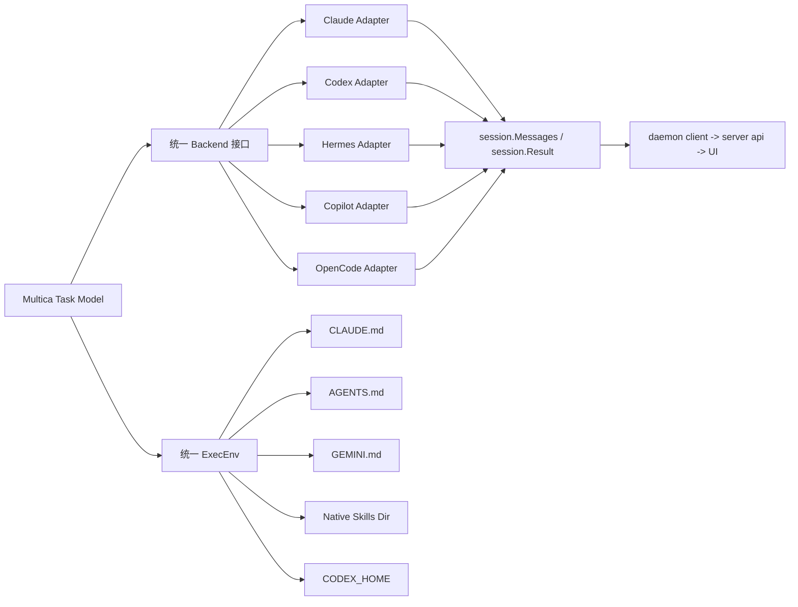

### 8.2 统一回写链路

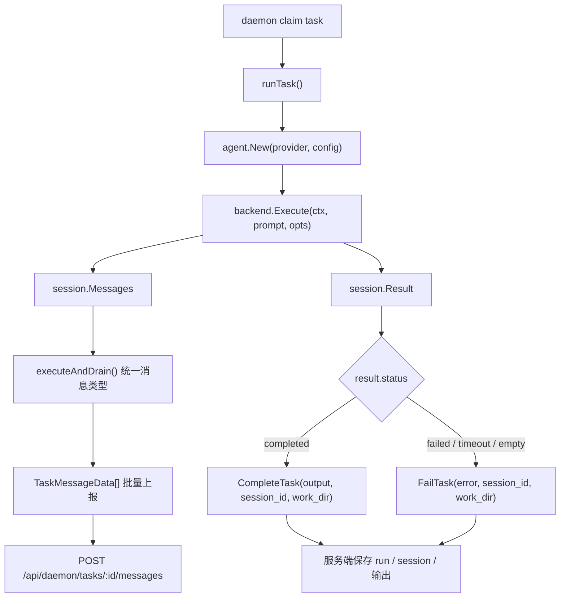

Daemon 把不同 CLI 的原始输出统一规整成：

- `text`
- `thinking`
- `tool_use`
- `tool_result`
- `error`

然后批量上报，而不是把 provider 的原始协议直接暴露给 UI 或服务端。

### 8.3 运行时上下文注入链路

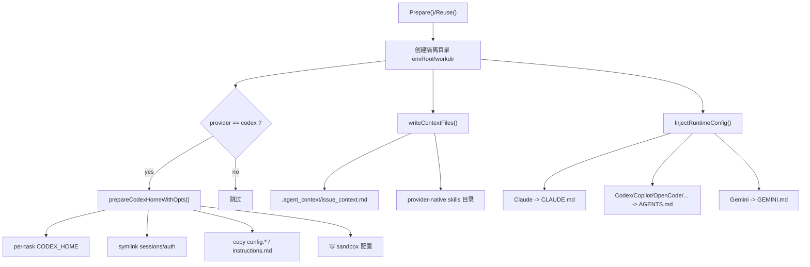

这里写入的并不只是“提示词”，而是一套运行期操作手册，内容包括：

- agent 身份
- 允许使用的 `multica` CLI 命令
- issue/comment/chat 的工作流
- repo checkout 方式
- 回复 comment 时的 parent 规则
- skills 列表
- 最终结果必须通过 issue comment 回传

### 8.4 Skills 注入方式

| Provider | Skills 注入位置 | 说明 |
|---|---|---|
| Claude | `.claude/skills/<name>/SKILL.md` | 走 Claude 原生项目级 skills 发现 |
| Codex | `CODEX_HOME/skills/<name>/SKILL.md` | 通过 per-task `CODEX_HOME` 注入 |
| Copilot | `.github/skills/<name>/SKILL.md` | 复用 Copilot 项目级 skills 机制 |
| OpenCode | `.config/opencode/skills/<name>/SKILL.md` | 复用 OpenCode 原生目录 |
| Pi | `.pi/agent/skills/<name>/SKILL.md` | 走 Pi 原生目录 |
| Cursor | `.cursor/skills/<name>/SKILL.md` | 走 Cursor 原生目录 |
| Kimi | `.kimi/skills/<name>/SKILL.md` | 走 Kimi 原生目录 |
| 默认回退 | `.agent_context/skills/<name>/SKILL.md` | 未知 provider 的兜底路径 |

### 8.5 各 Agent CLI 接入方式对照

| Provider | 主要接入方式 | 配置入口 | Skills 注入 | 特殊点 |
|---|---|---|---|---|
| Claude | CLI + 流式 JSON | `CLAUDE.md` | `.claude/skills/` | 按 Claude Code 项目约定接入 |
| Codex | `codex app-server --listen stdio://` | `AGENTS.md` | `CODEX_HOME/skills/` | 使用单独的 per-task `CODEX_HOME` |
| Hermes | ACP 协议适配 | `AGENTS.md` | 回退或 provider 约定 | 更像协议桥接层 |
| Copilot | CLI | `AGENTS.md` | `.github/skills/` | 复用 Copilot 项目级技能机制 |
| OpenCode | CLI | `AGENTS.md` | `.config/opencode/skills/` | 复用 OpenCode 原生技能目录 |

### 8.6 Codex 的特殊处理

Codex 是当前接入里最“深”的一个，因为它除了读 `AGENTS.md`，还会被注入单独的 `CODEX_HOME`。

这个 per-task `CODEX_HOME` 的设计意图是：

- 让不同任务拥有隔离的 Codex 运行配置
- 又不丢失共享的认证和 session 目录

具体表现为：

- symlink `sessions/`
- symlink `auth.json`
- copy `config.json`
- copy `config.toml`
- copy `instructions.md`
- 再由 daemon 写入 sandbox 配置

---

## 9. 会话复用与本地可见性

### 9.1 会话复用机制

Multica 并不是每次调用 Agent 都重新开一个全新会话，而是会尽量复用之前建立好的 `session_id` 和 `work_dir`。

| 场景 | 复用键 | 说明 |
|---|---|---|
| Issue 任务 | `(agent_id, issue_id)` | 同一个 Agent 在同一个 Issue 上复用最近一次完成任务的 session |
| Chat 任务 | `chat_session_id` | 同一个聊天会话持续复用 session 指针 |

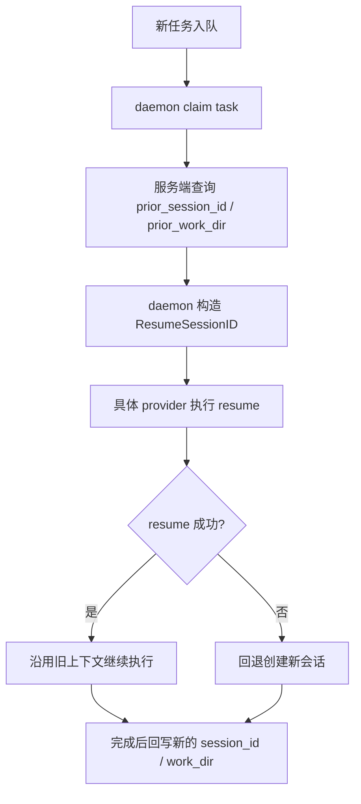

### 9.2 Issue 与 Chat 的区别

Issue 模式下，复用粒度是：

- 同一个 `agent`
- 同一个 `issue`

Chat 模式下，复用粒度是：

- 同一个 `chat_session`

而且 chat 模式会在任务完成或失败时，把 `session_id` / `work_dir` 同步写回 `chat_session`，确保下一条消息继续沿着同一个会话上下文走。

### 9.3 各 Provider 的 resume 方式

| Provider | 恢复方式 | 说明 |
|---|---|---|
| Claude | `--resume <session_id>` | CLI 级 resume |
| Codex | `thread/resume` | 失败时回退 `thread/start` |
| Copilot | `--resume <session_id>` | CLI 级 resume |
| OpenCode | `--session <session_id>` | CLI 级 session 传递 |
| Gemini | `-r <session_id>` | CLI 级 resume |
| Cursor | `--resume <session_id>` | CLI 级 resume |
| Hermes | `session/resume` | ACP 协议恢复会话 |
| Kimi | `session/resume` | ACP 协议恢复会话 |
| Pi | `--session <path>` | 复用的是 session 文件路径本身 |

### 9.4 本地能否看到这些会话

这里的“本地”必须先定义清楚：它指的是 **runtime 所在宿主机**，不是发起操作的浏览器，也不一定是当前这台电脑。

如果 Agent 绑定的是你的 runtime，那么：

- 会话文件
- workdir
- 日志

通常落在你的机器上。

如果 Agent 绑定的是别人的 runtime，那么这些原始文件和目录也落在别人的宿主机上，而不是你的电脑。

### 9.5 哪些 Provider 的本地会话位置是明确的

| Provider | 本地路径 | 说明 |
|---|---|---|
| Codex | `~/.codex/sessions/YYYY/MM/DD/*.jsonl` 或 `$CODEX_HOME/sessions/...` | 仓库代码会主动扫描这些 JSONL 统计 usage |
| Pi | `~/.multica/pi-sessions/*.jsonl` | session 文件路径本身就是可复用标识 |

对于以下 provider，当前仓库中可以明确看到“逻辑 session_id 会被保存并复用”，但没有统一管理其原始落盘文件路径的逻辑：

- Claude
- Copilot
- OpenCode
- Gemini
- Cursor
- Hermes
- Kimi

### 9.6 为什么这会放大 runtime 权限风险

会话复用意味着任务不是“一次性在某台机器上执行完就结束”，而是可能持续：

- 复用同一台机器的 `work_dir`
- 复用同一台机器的 session 上下文
- 复用同一台机器上的 CLI 配置、认证目录和技能目录

因此 runtime 绑定权限如果过宽，风险也会以“长会话”的形式被放大。

---

## 10. Repositories 处理机制

### 10.1 三段式模型

Multica 对 `Repositories` 的处理，不是“任务启动时自动把代码挂载进来”，而是：

- Workspace 维护 repo 元数据清单
- Daemon 在宿主机维护 bare clone cache
- Agent 需要代码时，显式执行 `multica repo checkout <url>`

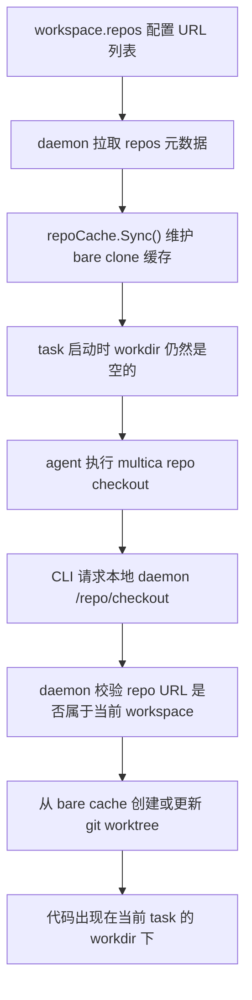

### 10.2 Workspace 中保存的是什么

Workspace 的 `repos` 字段保存的是仓库元数据，通常包含：

- `url`
- `description`

它的语义是：

- 这个 workspace 允许访问哪些 repo

而不是：

- 这些 repo 在任务开始时会自动出现在 `workdir`

### 10.3 Daemon 的 bare cache

Daemon 会把 workspace 的 repo 列表同步到本机 bare cache：

- 没缓存时：`git clone --bare`
- 有缓存时：`git fetch origin`

这个 bare cache 是共享源，不是直接给 agent 操作的工作目录。

### 10.4 Task 启动时不会自动 checkout

`execenv` 会把 repo 信息写进运行时配置，让 agent 知道：

- 有哪些 repo 可用
- 应该怎么执行 `multica repo checkout <url>`

但 task 的 `workdir` 初始仍然是空的。只有 agent 真正判断“这次任务需要代码”时，才会显式 checkout。

### 10.5 `multica repo checkout <url>` 真正做了什么

这个命令不会直接让 agent 自己跑 `git clone`，而是：

1. agent 读取当前 task 的环境变量和 `workdir`
2. 向本机 daemon 发起 `POST /repo/checkout`
3. daemon 校验 repo 是否属于当前 workspace
4. daemon 从 bare cache 创建或更新 worktree

因此 checkout 的真正落地点是：

- daemon 宿主机

而不是：

- 浏览器
- 远端服务端

### 10.6 真正出现在 task 目录里的是 worktree

daemon 会从 bare repo 派生出一个工作树放进当前 task 的 `workdir`。其分支名通常类似：

- `agent/<agent-name>/<short-task-id>`

也就是说，task 中得到的是一个：

- 可编辑的普通 git 工作树

而不是一个完整重新 clone 的独立仓库副本。

### 10.7 worktree 的复用策略

如果当前 `workdir` 中已经存在对应 repo 的 worktree，daemon 不会一律重新创建，而是：

- `git reset --hard`
- `git clean -fd`
- 再从默认分支切一个新 branch

这说明 repo 目录可以复用，但会被重置到干净状态，不会保留上一个 task 的未提交修改或脏文件。

### 10.8 `description` 的真实作用

`description` 主要是：

- 帮助 agent 理解 repo 用途
- 帮助人类在 workspace 配置页面识别 repo

例如：

- `frontend web`
- `backend api`
- `mobile app`

它可能影响 agent 的“推理选择”，但不参与系统权限判定。

### 10.9 真正参与校验的是 URL

系统真正用于权限判断和路由的是：

- `repo URL`

也就是说：

- allowlist 按 URL 建立
- bare cache 按 URL 建立
- checkout 请求按 URL 发送
- daemon 是否允许 checkout，也按 URL 判断

因此：

- `description` 是给人和 agent 看的语义标签
- `url` 才是系统识别 repo 的主键

---

## 11. 运行时归属与执行风险

### 11.1 当前实现结论

当前代码中，`agent_runtime.owner_id` 已存在，但它的主要用途是：

- 运行时列表按 `owner=me` 过滤
- 删除 runtime 时限制“普通成员只能删除自己的 runtime”
- UI 展示 runtime 的 owner 信息

但在 Agent 创建与更新链路中，后端校验的是：

- `runtime_id` 必须属于当前 workspace

没有额外校验：

- `runtime.owner_id` 是否等于当前操作者
- 普通 member 是否只能绑定自己的 runtime

因此，当前语义更接近：

- runtime 是 workspace 共享资源

而不是：

- runtime 是个人独占资源

### 11.2 风险链路

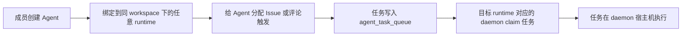

问题不在于“能不能直接登录别人的电脑”，而在于：

- 可以借用别人的 runtime 作为执行入口
- 可以让任务在别人启动 daemon 的机器上运行
- 还可能持续复用那台机器上的会话、repo worktree、CLI 配置和认证目录

### 11.3 风险分解

| 风险点 | 说明 |
|---|---|
| 本地代码访问 | Agent 会在 runtime 关联的本地工作目录/仓库环境中执行 |
| 本地凭据继承 | daemon 所在机器可能已有 Git、云厂商、模型平台等登录态 |
| MCP/本地工具调用 | Agent 可能复用 runtime 宿主环境已安装的 CLI、脚本、MCP 配置 |
| 资源消耗 | 普通成员可间接消耗他人机器的 CPU、网络、磁盘、模型配额 |
| 安全边界混淆 | UI 中看到的是“我的 agent”，实际执行位置却可能是“别人的宿主机” |

### 11.4 当前权限现状

| 能力 | owner/admin | member |
|---|---|---|
| 查看 workspace 内全部 runtime | Y | Y |
| 创建 agent 绑定自己的 runtime | Y | Y |
| 创建 agent 绑定别人的 runtime | Y | Y（当前实现允许） |
| 更新 agent 改绑别人的 runtime | Y | Y（当前实现允许） |
| 删除别人的 runtime | Y | N |

这说明当前语义是分裂的：

- 删除维度上：runtime 像个人资源
- 绑定执行维度上：runtime 又像 workspace 共享资源

### 11.5 更合理的权限模型

建议统一成以下语义：

| 操作 | owner/admin | member |
|---|---|---|
| 绑定自己的 runtime | Y | Y |
| 绑定别人的 runtime | Y | N |
| 删除自己的 runtime | Y | Y |
| 删除别人的 runtime | Y | N |

后端最小改动点通常是：

- `CreateAgent`
- `UpdateAgent`

在已通过 workspace 校验后，再增加一层：

- 非 owner/admin 时，要求 `runtime.owner_id == current_user_id`

否则返回 `403 Forbidden`。

### 11.6 与评论触发问题的关系

评论触发和 runtime 绑定是两层不同问题：

- 评论触发：决定任务是否入队
- runtime 绑定：决定入队后在哪台机器执行

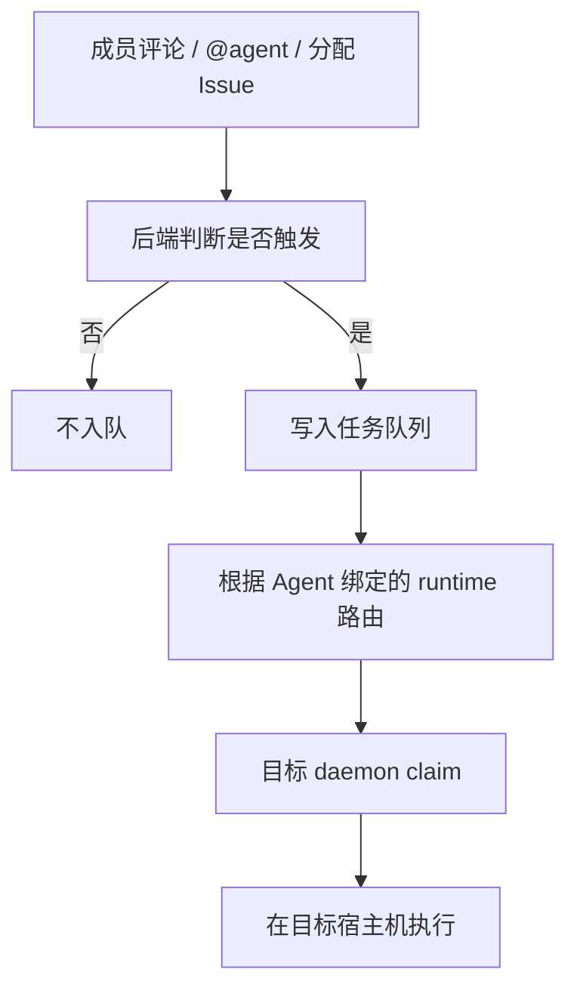

### 11.7 上游 GitHub 讨论线索

目前未发现一个直接描述“member 可以把 agent 绑定到别人 runtime，导致任务在别人电脑执行”的独立 issue，但已有强相关讨论：

| 类型 | 链接 | 说明 |
|---|---|---|
| PR | [multica-ai/multica#534](https://github.com/multica-ai/multica/pull/534) | 给 `agent_runtime` 增加 `owner_id`，并实现 Mine/All 过滤与删除权限，但未收紧 Agent 绑定权限 |
| PR | [multica-ai/multica#324](https://github.com/multica-ai/multica/pull/324) | 调整 private/workspace agent 的可见性、mention 与管理权限，没有涉及 runtime 绑定边界 |
| Issue | [multica-ai/multica#1114](https://github.com/multica-ai/multica/issues/1114) | 指出“workspace member 可以创建 agent”会把 `custom_env` 注入 daemon host 子进程，形成宿主机安全风险 |
| Issue | [multica-ai/multica#1113](https://github.com/multica-ai/multica/issues/1113) | 同样把“workspace member 可以创建 agent”作为安全问题前提 |

从这些讨论可以推断：

- 上游已经意识到 agent 配置会影响 daemon host
- 也已经给 runtime 建立了 `owner_id` 概念
- 但尚未把 runtime owner 真正纳入 Agent 绑定权限判定

---

## 12. 实时事件、安全与治理

### 12.1 实时事件模型

| 类别 | 事件示例 | 用途 |
|---|---|---|
| Issue | `issue:created/updated/deleted` | 列表、详情、看板同步 |
| Comment | `comment:created/updated/deleted` | 评论流同步 |
| Reaction | `reaction:added/removed` | 评论和问题反应同步 |
| Agent | `agent:created/status/archived` | Agent 列表与状态同步 |
| Task | `task:dispatch/progress/completed/failed` | 执行过程可视化 |
| Inbox | `inbox:new/read/archived` | 通知中心与红点 |
| Workspace/Member | `workspace:updated/member:added/removed` | 权限和成员视图同步 |
| Invitation | `invitation:created/accepted/declined` | 邀请生命周期同步 |
| Autopilot | `autopilot:*` | 自动化规则状态与运行反馈 |
| Chat | `chat:message/done` | 聊天流式更新 |

### 12.2 安全策略

| 维度 | 策略 |
|---|---|
| 身份认证 | JWT + Cookie + PAT + Daemon Token |
| Token 存储 | PAT/Daemon Token 哈希存储 |
| CSRF | Cookie 模式下要求 `X-CSRF-Token` |
| CORS/CSP | 跨域白名单 + CSP 头 |
| 限流 | 验证码发送限频 |
| 多租户隔离 | workspace 中间件 + SQL `workspace_id` 过滤 |
| 错误恢复 | Recoverer 防止 panic 扩散 |
| 审计基础 | `activity_log` + 请求日志 + 任务消息 |

### 12.3 设计优势

- 双层隔离：权限中间件 + 数据层过滤，降低越权风险
- 事件驱动：便于扩展通知、审计、自动化触发
- 前端跨平台共享高：核心业务逻辑复用度高
- Agent 执行链路可观测：队列、进度、消息、用量可追踪

### 12.4 潜在改进方向

- 对非验证码类关键写接口增加统一限流策略
- 增强审计维度（操作前后 diff、管理员高危操作专审计）
- 为权限模型提供更细粒度策略（如资源级 ACL 或策略引擎）
- 明确区分“workspace 级共享资源”和“个人独占执行资源”

---

## 13. 结论

从整体上看，Multica 已经形成一条清晰的主线：

- 前端通过 core/views/ui 分层共享业务逻辑
- 后端负责权限闭环、多租户隔离、任务编排与实时同步
- Daemon 负责把 Agent 任务真正落到本地宿主环境执行
- Agent CLI 通过统一 Backend 与 ExecEnv 适配进系统

这套设计适合中小团队高频协作与 AI 自动化落地，也具备继续向企业级治理能力扩展的基础。

但从当前实现看，最值得持续关注的不是“Agent 能不能执行任务”，而是三条执行边界是否一致：

- runtime 的归属边界
- session / workdir / repo 的宿主机边界
- workspace 权限与宿主环境权限之间的映射边界

如果后续继续面向多人协作和真实宿主机执行环境演进，`runtime owner` 与 `agent binding` 的权限收口，应该被视为优先级较高的治理点。
