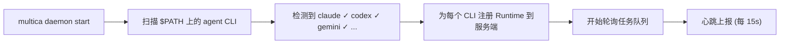
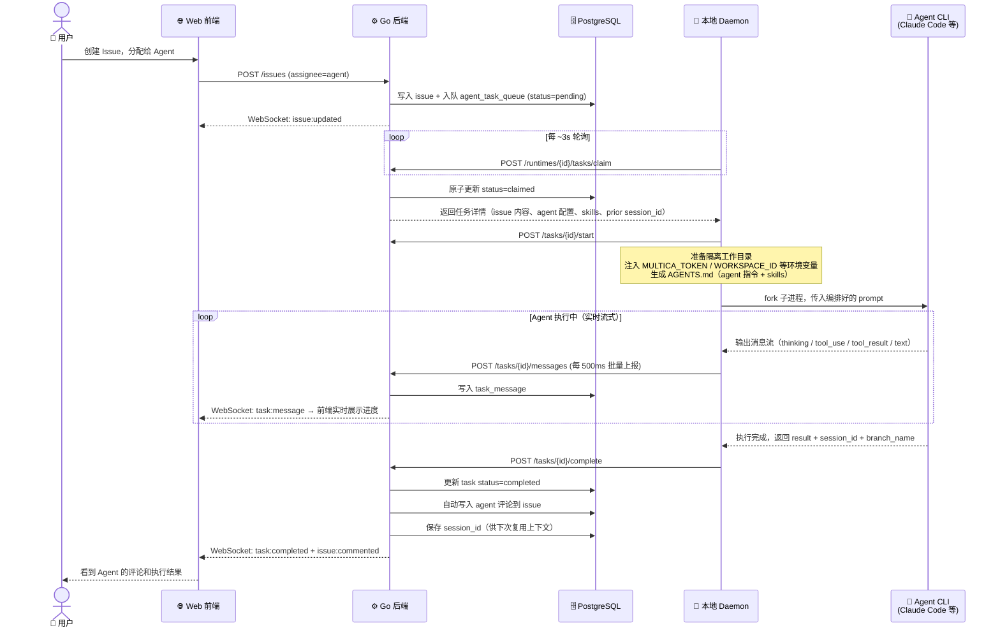
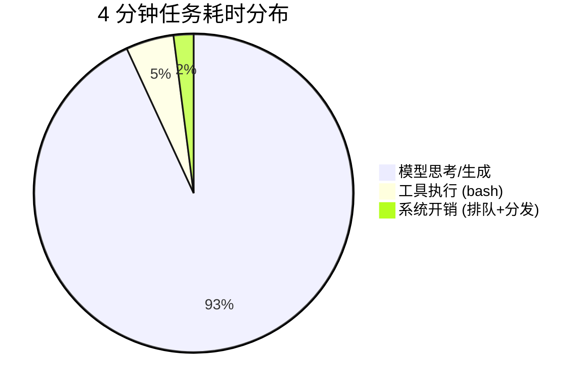

# Multica 组会分享大纲（10 分钟）

## 建议结构：2-4-2-2

---

## Part 1 — 为什么需要 Multica（2 min）

### 1.1 背景：AI Agent 现状（1 min）

- 2025-2026 年 coding agent 爆发式增长：Claude Code、Codex、Gemini CLI、Cursor Agent…
- 但目前团队用 agent 的方式还是**单人单工具**：
  - 在 IDE 里和 agent 对话
  - 手动 copy-paste prompt
  - 每次任务都要人盯着、手动喂上下文
  - 多个 agent 各干各的，没有统一看板和进度追踪
  - agent 做得好的方案无法沉淀复用给团队

- 核心矛盾：**agent 越来越能干，但团队协作层还是断裂的**

### 1.2 Multica 的思路（1 min）

- **把 agent 当成团队成员管理**，不是当成工具调用
- 在 Linear / Jira 式的任务管理上叠加 agent 调度能力
- Agent 有自己的名字、头像、profile，出现在看板上
- 支持分配任务、自主执行、主动汇报进度、评论 issue
- 供应商中立：同一个平台接入 Claude Code、Codex、Gemini 等 8+ 种 agent

- 一句话总结：
  > "Your next 10 hires won't be human." — agent 是你的队友，不是你的 CLI。

- **和 GitHub Copilot / Cursor 的差异**：
  - Multica 是**任务管理平台**，不是 IDE 插件
  - Agent 是项目成员，出现在看板上，不是代码补全工具
  - 对标的是 Linear + agent 调度，不是 VS Code + AI 补全

---

## Part 2 — 技术实现拆解（4 min）

### 2.1 整体架构（1 min）

```
┌──────────────┐     ┌──────────────┐     ┌──────────────────┐
│   Next.js    │────>│  Go Backend  │────>│   PostgreSQL     │
│   Frontend   │<────│  (Chi + WS)  │<────│   (pgvector)     │
└──────────────┘     └──────┬───────┘     └──────────────────┘
                            │
                     ┌──────┴───────┐
                     │ Agent Daemon │  ← 跑在你的机器上
                     └──────────────┘    (Claude Code / Codex / Gemini…)
```

- 前端 Next.js App Router + 后端 Go（Chi 路由 + gorilla/websocket）+ PostgreSQL（pgvector）
- **核心设计：Daemon 跑在本地机器上**
  - 自动检测已安装的 agent CLI（claude, codex, gemini, opencode, pi, cursor-agent…）
  - 通过 HTTP polling 从服务端领取任务
  - 在本地 fork 子进程执行 agent CLI
  - 执行结果实时回写服务端
- WebSocket 实时推送执行进度到前端
- 支持 Cloud 和 Self-hosted 两种部署方式

### 2.2 本地 CLI 接入方式（1 min）

**安装只需两步：**

```bash
brew install multica-ai/tap/multica   # 安装 CLI
multica setup                          # 一键：配置 + 登录 + 启动 daemon
```

**Daemon 启动后做了什么：**



- Daemon 自动扫描 `$PATH` 上的 agent CLI
- 每个检测到的 CLI 注册为一个 **Runtime**（服务端可见）
- 在 Web 端 Settings → Agents 创建 agent，绑定到你的 runtime
- 之后分配 issue 给 agent，daemon 自动 claim 并在本地 fork 子进程执行
- 支持最多 20 个并发任务（可配置）
- Session 可复用：同一个 agent 对同一个 issue 的后续任务会恢复之前的上下文

### 2.3 一次 Issue → Agent 完成的完整时序（2 min）

**这是整个系统最核心的链路：**



**关键数字**（来自实测数据）：

| 阶段 | 耗时 |
|---|---|
| Issue 入队 → Daemon claim | ~3s |
| claim → agent 子进程启动 | < 1s |
| 消息批量上报间隔 | 500ms |
| **系统总开销** | **< 5s** |
| 剩余时间 | 全是 agent 在思考和执行 |

---

## Part 3 — 实际效果与数据（2 min）

### 3.1 现场 Demo（如果环境就绪）

- 在看板上创建一个 issue，assign 给 agent
- 切到 issue 详情页，实时看到 agent 的 thinking → tool_use → text 流
- agent 自动评论结果，任务完成

### 3.2 实测性能对比

来自真实环境同一个 issue 的两次执行：

| 维度 | 第一次（慢） | 第二次（快） |
|---|---|---|
| Agent 配置 | GPT-5 mini via Copilot | GPT-5.4 via Codex |
| 总执行时长 | **4 分 02 秒** | **1 分 12 秒** |
| 最大单段思考空档 | 60s | 14s |
| 工具执行时间合计 | ~12s | ~10s |
| 系统排队 + 分发开销 | < 5s | < 5s |

**核心发现：**

- 系统层的开销可以忽略不计（< 5s），瓶颈完全在 agent 思考时间
- 同一个任务，换了 runtime/model 组合后快了 3.4 倍
- → Multica 的抽象是对的：**任务调度和 agent 执行是完全解耦的**，可以灵活切换
- 慢的原因不是系统链路长，而是 agent workflow 的编排方式（解释型 vs 执行型）

### 3.3 耗时分布可视化



**一句话总结：** agent 越聪明、执行越直接，总耗时越短。Multica 作为调度层几乎不成为瓶颈。

---

## Part 4 — 对团队的价值 + 讨论（2 min）

### 4.1 能帮我们做什么

- **重复性任务自动化**：代码审查、bug triage、文档更新、依赖升级
- **Skills 沉淀**：agent 做得好的方案变成可复用 skill，团队共享
- **统一看板**：人和 agent 的工作在一个面板上管理，不用来回切工具
- **Autopilot 定时任务**：比如每日 bug 扫描、每周代码质量报告

### 4.2 额外亮点

- 开源（MIT），活跃开发中，GitHub 可查
- 支持 8+ 种 agent CLI（Claude Code / Codex / Gemini / Pi / Cursor Agent…）
- 支持自部署，数据完全可控（Docker 一键部署）
- 多 workspace 隔离，适合多项目 / 多团队
- Agent 可以主动创建 issue、评论、改状态 — 不只是被动执行

### 4.3 当前局限（客观讲）

- Agent 执行速度取决于底层模型，不是 Multica 能优化的
- Runtime 权限模型还在完善中（比如 runtime 归属校验）
- 复杂任务还是需要人 review agent 的输出

### 4.4 开放讨论

留一两个问题给大家讨论：
- "如果我们团队引入，哪类任务最适合先交给 agent？"
- "大家觉得 agent 作为队友，最需要补齐的能力是什么？"

---

## 准备 Checklist

- [ ] 准备一张 Multica 看板截图（人和 agent 并排出现，README 里有 `hero-screenshot.png`）
- [ ] 如果要现场 Demo：提前在自部署环境准备好一个简单任务
- [ ] 把 mermaid 时序图提前渲染好（用 Mermaid Live Editor 或飞书文档预览），避免现场渲染失败
- [ ] 准备 `my-docs/multica-agent-4min-耗时分析.md` 里的对比数据作为备用素材
- [ ] 控制节奏：技术部分不要展开讲代码，用图说话
